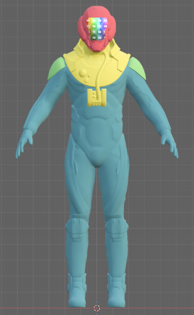
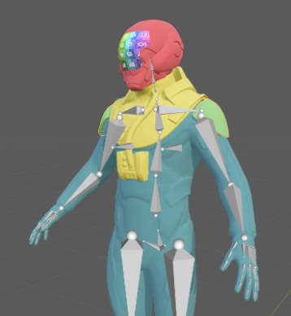
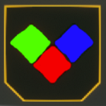
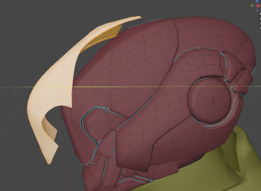
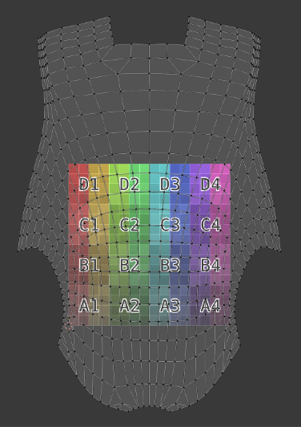
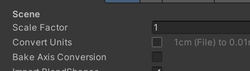
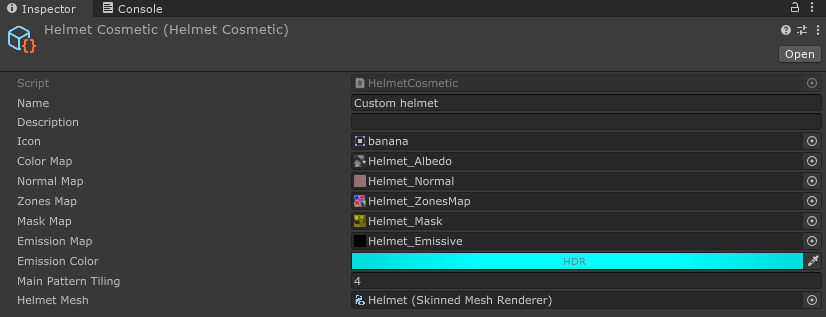
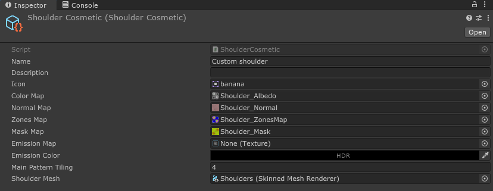
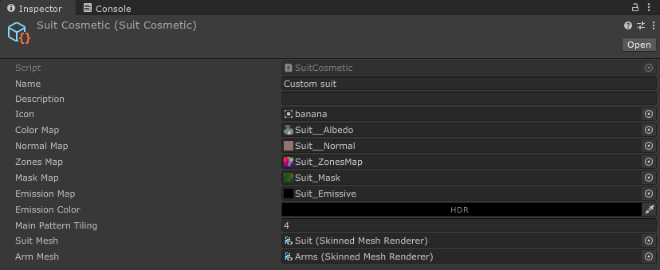
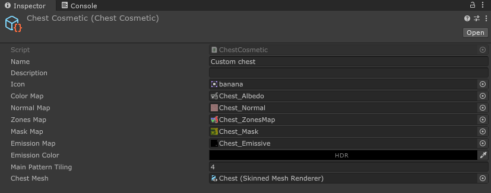

# Armor Pieces
In the sample project you can find the following files to help you get started on making custom armor pieces:

**Ectype Base Rig:** **[Ectype_Base.fbx](https://github.com/HutlihutGames/void_crew_mods_sample/blob/master/Assets/Mods/Cosmetics/Ectype_Base.fbx)**
This is a basic Ectype mannequin to help with skinning, or to use as a base for making new armor pieces. 
Blend file is also available [here](https://github.com/HutlihutGames/void_crew_mods_sample/tree/master/Blend).

There are 4 types of cosmetic armor pieces ectypes can wear:
- <code style="color : red">Helmet</code>
- <code style="color : lightblue">Chestpiece</code>
- <code style="color : lightgreen">Shoulderpieces</code>
- <code style="color : yellow">Suit</code>



To create an armor piece, right click in the project window, and in the menu go to Create > Void Crew > Cosmetics.
Then select `Helmet`, `Shoulder`, `Suit` or `Chest`.


This will create a new cosmetic scriptable object for the chosen type.

Most of these just need skinning and textures to work. 
However, the helmet is able to show projections, so it requires additional steps if you want to take advantage of that. 
See further down for details on how to do that.

Furthermore, a secondary UV map can be used to control how patterns are displayed on all cosmetic items. 
If there is no secondary UV map set up, the first one is used instead. 
This can be useful if you want to change the direction or the size of patterns.

**[ProjectionTest.png](https://github.com/HutlihutGames/void_crew_mods_sample/tree/master/Assets/CosmeticsHelpers)**: 
A test projection with a color grid.

## Skinning
For creating any type of wearable cosmetics, you will need to skin the cosmetic to the ectype rig. You may also know this as weight painting. 

Add your custom mesh to the ectype base rig. You can use this mannequin to do the skinning.

It is recommended that helmets are only driven by the “head” bone for accurate look direction.



## Texturing
Cosmetics can use five different textures

**Base color**: This is the main color texture. You may also know it as the Albedo Map.

**Emission Map**: This is an optional texture that controls emissive parts. 
Black means no emission, anything else becomes emissive. The emission color is defined in the `Emission Color` field on the asset. 
This is an HDR color, so you can increase the intensity of the emission.  

**Normal Map**: A regular normal texture. Adds "depth" to the texture, to make the mesh look less flat without adding additional geometry.
The normal map texture to `Texture Type: Normal Map` in Unity.

**Mask Map**: This texture controls the metallicness, smoothness, and ambient occlusion of the cosmetic using the following color channels:
- Red → Metallic
- Green → Ambient Occlusion
- Alpha → Smoothness

**Zone Map**: This texture tells the cosmetic which color to use from the applied color scheme.

- <code style="color : red">Red</code> - primary (this is where patterns appear too), this usually covers the largest parts of armor cosmetics
- <code style="color : lightgreen">Green</code> - secondary
- <code style="color : blue">Blue</code> - tertiary, usually used for embellishments or decorative elements
- Black - Keep the color coming from the Base Color texture



**Main Pattern Tiling**:
How many times to tile the pattern on the UV map. A higher number will increase the density of the pattern.

## Helmet setup - Additional Steps
Helmets can display projections, so here is how you can make sure they work properly.

Duplicate the area of the mesh that you want to use for displaying projections. Keep the helmet one mesh only!

Apply a second material to the projection area. This will be replaced with a transparent projection material in-game.



When UV mapping the projection plate, you can use the test projection texture to check for any stretching or obscured parts.

Projection textures don't repeat (except for tiling ones), so don't worry about overshooting the UV map.



## Materials Setup
Materials assigned to the custom models will not be directly used currently.
What this means is that the various textures defined by the cosmetic will be copied over to a new instance of the 
same materials that all other armor pieces currently use.

Therefore all the armor piece meshes must be setup such that they only have 1 material slot, which covers the whole mesh (+ one slot for projection if a helmet).

We plan on expanding this feature in the future, so it will be easier for mods to utilize models that aren't setup to use a single material slot.

## Exporting From Blender
To avoid weird orientations or sizes on cosmetics, make sure to export with the correct setup:
- Up axis: Y+
- Forward axis: Z+
- 1.0x scale compared to the provided mannequin (to check if that's correctly imported, the ectype should measure around 1.9 meters tall)

In Unity's import settings for the model: disable `Convert Units`.



## Helmet


**Helmet Mesh**:
Reference to the `Skinned Mesh Renderer` at the root prefab of the helmet, which contains the helmet mesh. 
The first material must be for the helmet, and second material for the projection.

```{important}
To drag and drop the Skinned Mesh Renderer you must drag and drop the component itself into the field. Dragging the prefab to the field does not work. 
```

## Shoulder Pieces


**Shoulder Mesh**:
Reference to the `Skinned Mesh Renderer` at the root prefab of the shoulder, which contains the shoulder pieces mesh.

## Suit


Note that The suit and arms share material and are a part of the same cosmetic, but need separate skinned mesh renderers.

**Suit Mesh**:
Reference to the `Skinned Mesh Renderer` at the root prefab of the suit, which contains the suit mesh.

**Arm Mesh**:
Reference to the `Skinned Mesh Renderer` at the root prefab of the arms, which contains the arms mesh.

## Chest Piece


**Chest Mesh**:
Reference to the `Skinned Mesh Renderer` at the root prefab of the chest piece.