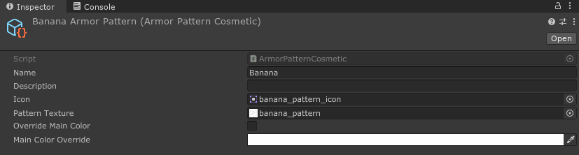
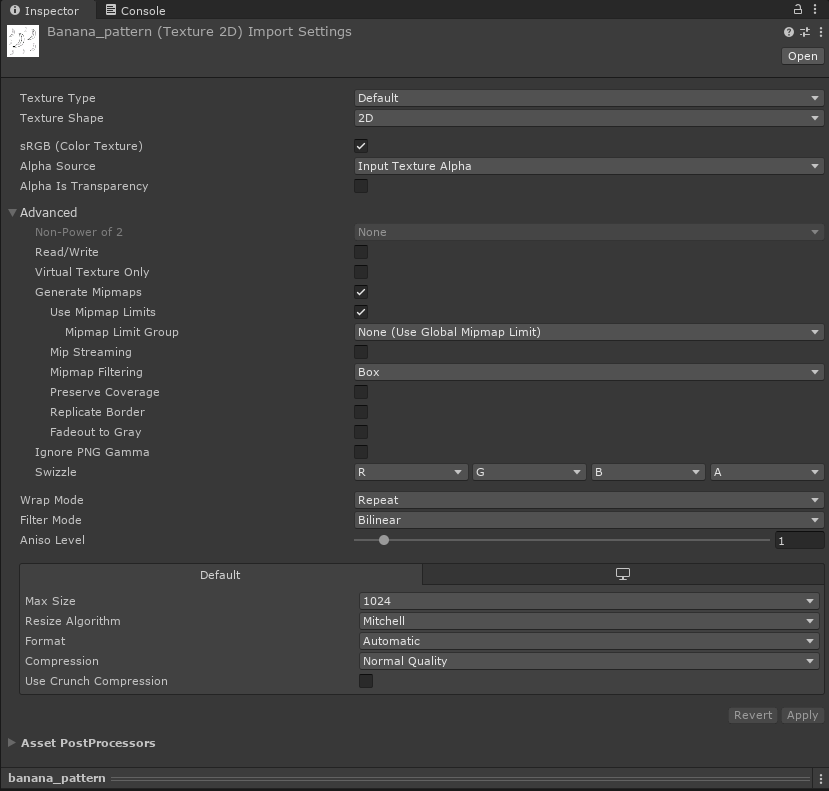
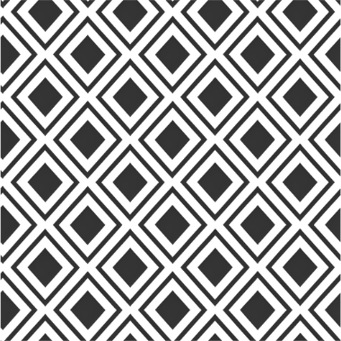
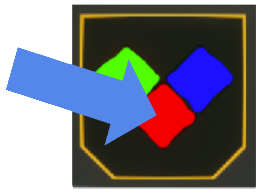

# Cosmetic Patterns
Patterns are simply cosmetics that get applied to armor pieces.

To create an armor color scheme or projection, right click in the project window, and in the menu go to Create > Void Crew > Cosmetics.
Then select `ArmorPattern`.

This will create a new cosmetic scriptable object for the chosen type.

**Pattern Texture**\
Patterns textures should be seamless and are recommended to have a resolution of at 512x512.

Remember to set the pattern's wrap mode to `Repeat` so the texture will be tiled on the armor.

Important: Pattern texture needs to be texture type `Default`, unlike the icon which needs to be `Sprite (2D and UI)`.

By default, they get applied to the parts of armor pieces that use the primary color of the picked color scheme.

**Override Main Color** \
Patterns don't necessarily have to be black and white, but unless a custom color override is picked, 
their colors are multiplied with the primary color of the armor. Which might lead to unexpected results.

If the pattern has a different main color, enable `Override Main Color` and specify the override color in `Main Color Override`.

