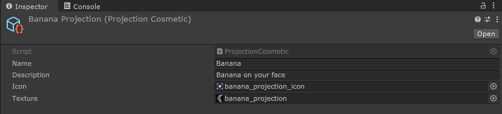
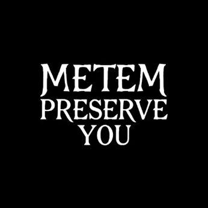
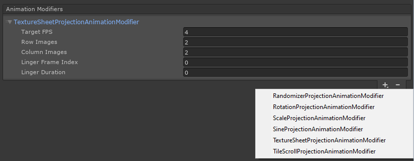

# Helmet Projections
Projections are textures that are projected onto the helmet's projection material.

To create an armor color scheme or projection, right click in the project window, and in the menu go to Create > Void Crew > Cosmetics.
Then select `Projection`.


This will create a new cosmetic scriptable object for the chosen type.



Projection textures should be at least 512x512 in resolution, for standard quality.

They are black and white, where true black (0, 0, 0) or transparent values are used for transparency.



You can use other colors too, but keep in mind that it gets multiplied by the projection color. 
So anything non-white gets mixed and might end up looking different than expected.


**Important**: By default projections get clamped (meaning the edges will get stretched out), so make sure to keep the edges black/transparent, at least 5 pixels wide for safety on each side.

## Projection Animations
You can add animation modifiers to a projection to create simple animations.

To add an animation modifier, click the + in the Animation Modifiers list and choose the type of modifier you want.



**Shared Properties**
- Target FPS: How often the modifier updates per second. Lower values make the animation update less frequently, which can create a choppier or more stepped look.

### Texture Sheet Animation
Use this animation modifier if your texture contains multiple frames that you want to cycle between.

The frames cycle from left to right, top to bottom. Meaning the first frame is the top left frame, and last is bottom right.

```{note}
Texture Sheet animation clashes with Tiling- or Rotation-based animations.
```

**Properties**
- Row Images: How many rows of frames the texture has.
- Column Images: How many columns of frames the texture has.
- Linger Frame Index: Which frame index to pause on. Frame 1 = index 0.
- Linger Duration: How many animation updates the animation should stay on the linger frame before continuing.

### Rotation Animation
Use this animation modifier to rotate the texture. The rotation pivots around the center of the texture.

```{tip}
Rotation animation works best with textures that are properly centered.
```

**Properties**
- Rotation Speed: How many degrees to rotate per second.

### Scale Animation
Use this animation modifier to animate the scale of the texture back and forth.

```{note}
Large scale values result in more visible tiling, which makes the texture appear smaller.
```

**Properties**
- Scale Factor: The maximum scale reached during the animation. A value above 1 makes the texture tile more densely.
- Easing Function: Determines how the scale interpolates from the start to the end of the animation. You can read more about easing functions [here](https://easings.net/).
- Speed: How fast the full in-and-out scale cycle runs.

### Tile Scroll Animation
Use this animation modifier to offset the texture over time and create a scrolling effect.

**Properties**
- Scroll Speed: How fast the texture scrolls across the X and Y axes.
    - X: Horizontal scrolling speed.
    - Y: Vertical scrolling speed.

### Sine Animation
Use this animation modifier to animate the texture offset using a sine wave, creating a smooth oscillating motion.

**Properties**
- Affected Axis: Which axis the sine movement should affect.
    - X: Moves the texture left and right.
    - Y: Moves the texture up and down.
    - Both: Moves the texture equally on both axes.
- Amplitude: How far the texture moves from its starting position.
- Frequency: How quickly the sine motion oscillates over time.

### Randomizer Animation
Use this animation modifier to randomly change the texture's rotation, offset, and/or scale at set intervals.

This is useful for glitchy, unstable, or non-repeating projection effects.

**Properties**
- Randomize Every X Frames: How many animation updates to wait before applying a new random value.
- Randomize Rotation: Enables random rotation changes.
- Rotation Range: The minimum and maximum rotation values, in degrees.
- Randomize Offset: Enables random offset changes.
- Offset Range: The maximum random horizontal and vertical offset applied from the center.
- Randomize Scale: Enables random tiling/scale changes.
- Tiling Range: The minimum and maximum random scale values.
    - Larger values result in more tiling, making the texture appear smaller.

```{note}
If scale randomization is enabled, the offset is adjusted automatically so scaling stays visually centered.

Any combination of rotation, offset, and scale randomization can be enabled at the same time.
```