# Skinning Guide
This is a simple guide on how to skin a mesh to a bone in Blender.  
You will need to do this to make your armor pieces follow the correct bones on the Ectype rig.

You can find more advanced guides elsewhere on the internet.

First, you need to open the rig. You can do this by either importing the [Ectype_Base.fbx](https://github.com/HutlihutGames/void_crew_mods_sample/blob/master/Assets/Mods/Cosmetics/Ectype_Base.fbx) or opening the [Ectype_Base.blend](https://github.com/HutlihutGames/void_crew_mods_sample/tree/master/Blend).

Importing FBX:  
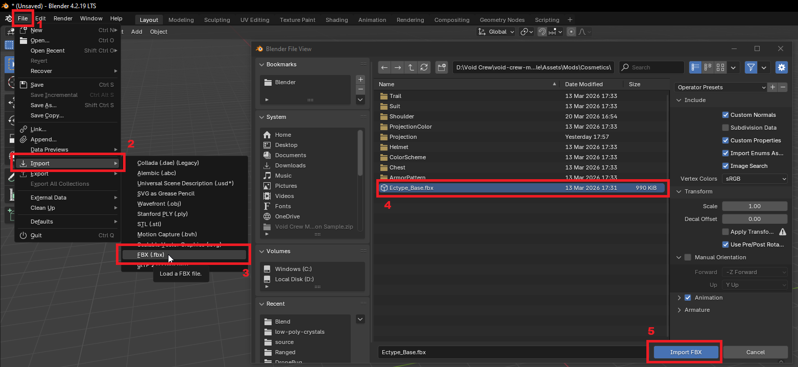

Alternatively, open the Blend file (requires Blender 5.0+):  
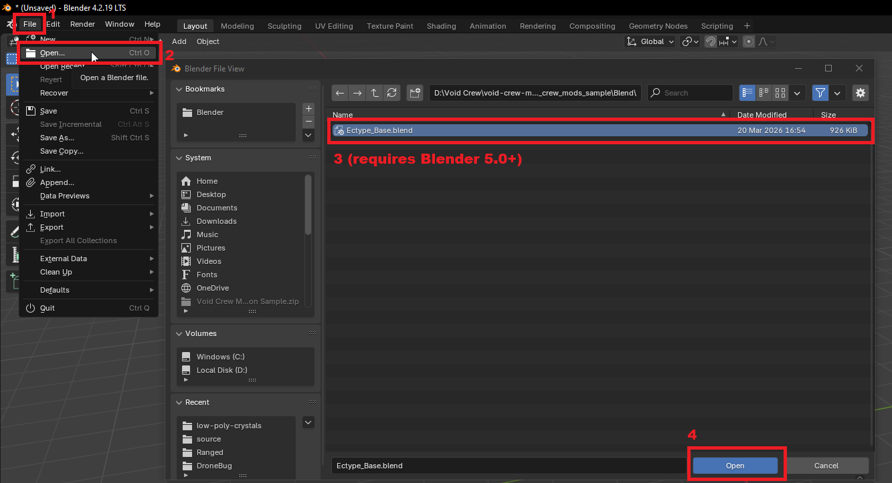

Once open, use the import process to also add your cosmetic mesh.

First, you’ll want to position your mesh relative to where you want it to be on the rig. In this guide, we’ll attach it to the Head bone.

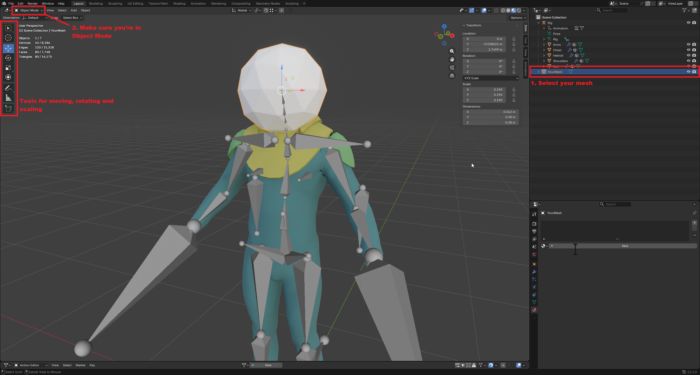

Once you're satisfied, you can start the process of making it follow the bone.

Parent the mesh to the rig by first selecting the mesh, and then selecting the rig second with Ctrl+Click.  
Then, while the mouse is in the viewport, press Ctrl+P to open the parenting menu and select **Armature Deform**.

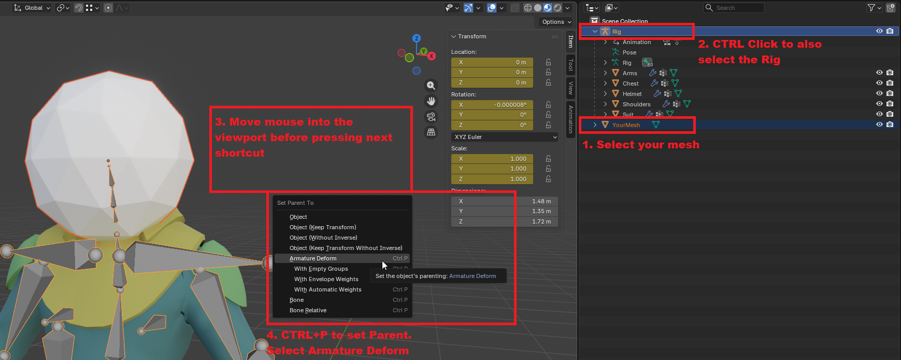

The mesh should now be a child of the rig and have an armature modifier.

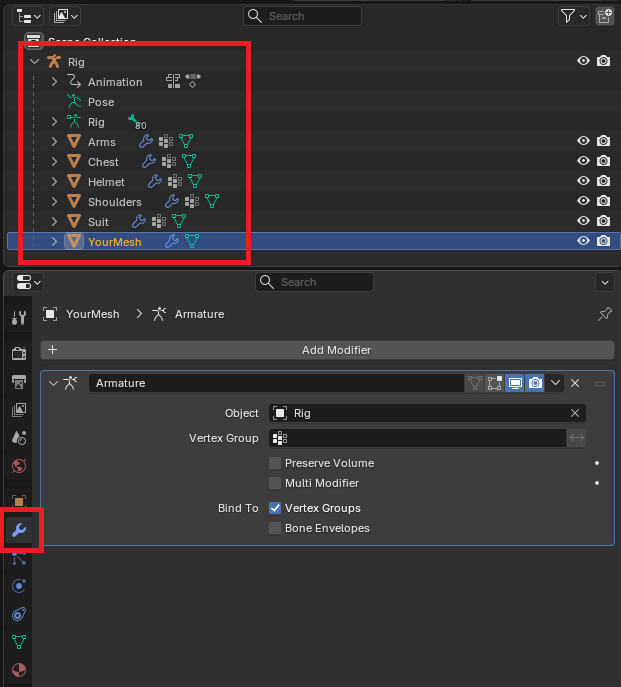

The mesh now knows which rig (skeleton) to use, but not which bone yet. For this, you will need to learn the name of the bone you want the mesh to follow.  
Go to Edit Mode while having the rig selected:

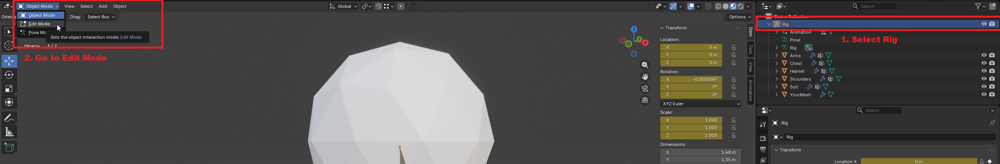

Select the bone you want the mesh to follow, then press F2 and copy the name of the bone.

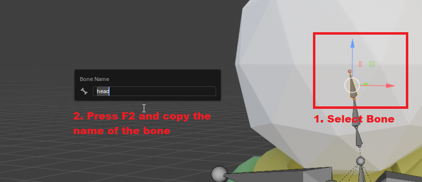

Once you have the name of the bone, go back to Object Mode and create a new vertex group. Name the vertex group after the bone.  
It is important that the name of the vertex group and the bone are exactly the same.

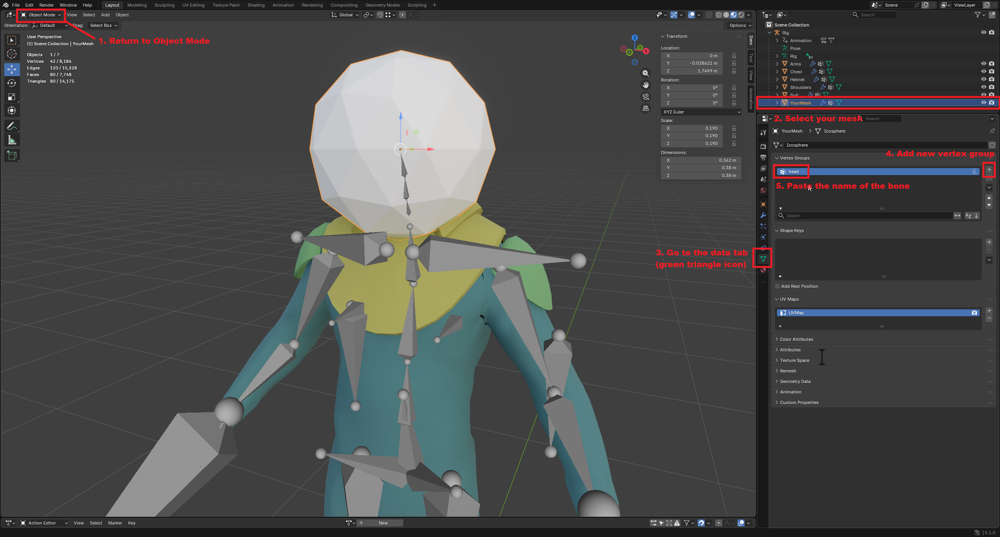

To make the vertex group follow the bone completely, go back to Edit Mode and assign it a weight of 1.

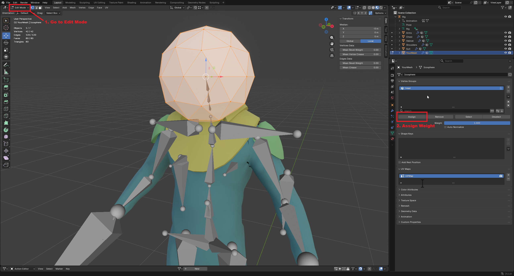

**That's it!**  
If you want to check that the mesh was completely weight-painted, go to Weight Paint Mode. The mesh should now be colored red.

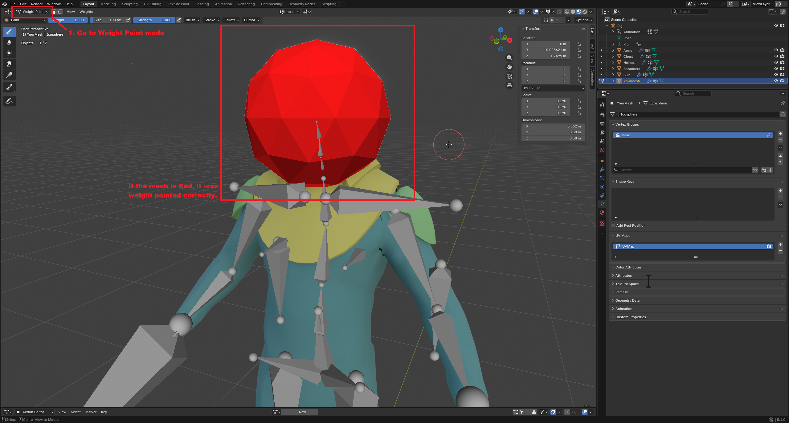

You can also test that the mesh is correctly following the bone. To do this, select the rig and go to Pose Mode. Then try moving a relevant bone.

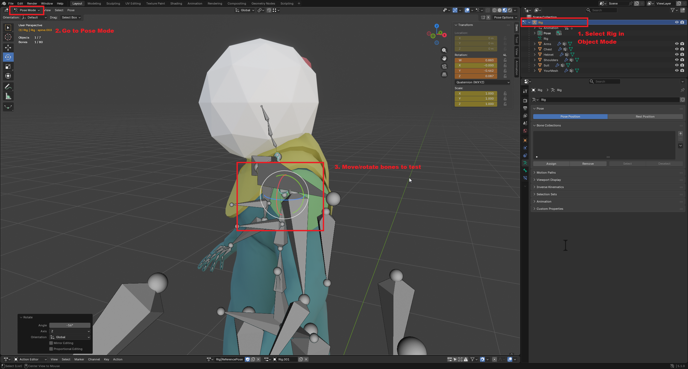