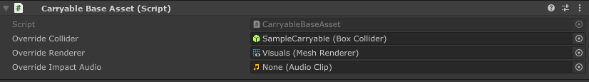
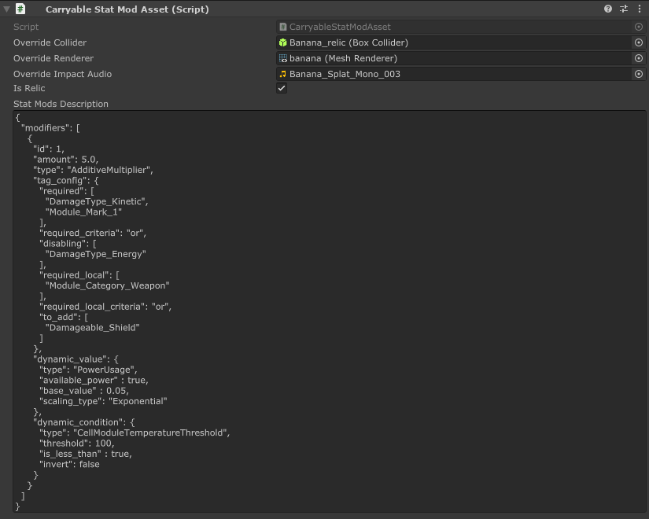
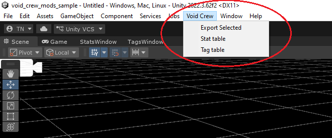
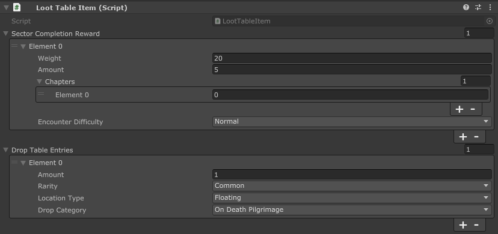

# Carryables
## Carryable Base Asset
This is the base component for making carryable assets. Use this component for adding simple carryables. 

**Override Collider** (Optional): 
The base physics collider around your carryable. 
This must be one of the following: Box Collider, Sphere Collider, Capsule Collider, or Mesh Collider. If left empty, Void Crew will use a default collider.

_For optimal performance, we recommend avoiding the use of a Mesh Collider unless necessary._ 

**Override Renderer** (Optional): 
The base renderer for your carryable. If left empty, the carryable will use a default renderer.
Note that the base renderer will be fully instantiated with all of its children on the carryable, so you can have multiple game objects included in the asset as long as they are children of the base renderer.
The base renderer is also used for creating the object outline.

**Override Impact Audio** (Optional): 
If you want audio clip used for the carryable's impact sound, then you can add one here.

## Carryable Stat Mod Asset
Add this component if you want to create a relic or a weapon mod (not to be confused with a mod that adds a weapon module mod).
This is an extension of the Carryable Base Asset, so your object should only have one of the two.

**Is Relic**: 
Enable if the asset is to be used as a relic. 
Relics will apply their stat modifiers across the whole ship by default. 
If false, then stat mod asset will be a weapon mod, and only able to apply its modifiers to the weapon it is added to.

**Stat Mods Description**: 
This field is for the stat modifiers to be applied by your stat mod asset.
This is formatted in Json. You can see examples in the Sample Project for how the Json is formatted.

**We recommend editing the Json in your IDE or a separate Text editor**, rather than within the Unity Inspector. You can copy paste the Json into the field.

You can view a list of all the Void Crew stats and tags via the Stats Window and Tags Window, found under "Void Crew" in the Toolbar.

[In the sample project](https://github.com/HutlihutGames/void_crew_mods_sample/tree/master/Assets/StatModExamples) 
you can find examples of modifiers written in JSON format for most Void Crew Relics, Weapon Mods and Homunculi

Read more about:
- **[Stat Modifiers](../../StatModifiers/StatModifiers.md)**
- **[Dynamic Modifiers](../../StatModifiers/DynamicModifiers.md)**
- **[Tags](../../Tags/Tags.md)**

## Loot Table Item
This component is what determines how your asset will naturally appear in the game as loot.

### Sector Completion Reward:
This adds the item as a sector completion reward (supply drop from completing a sector's main objective).

**Weight**: 
The chance of the item being dropped. 1 is the default value for all existing items. 2 would make it appear twice as often, 0.5 half as often and so on.

**Amount**: 
How many instances of the item will be dropped. Normally this is just 1, but is for example used to drop several alloy clusters as a reward.

**Chapters**: 
Which parts of the run the drop should be available in. 
In a Pilgrimage, each chapter ends with a boss sector, after which a new chapter starts. In vanilla the game only uses chapter 0 and 1.

**Encounter Difficulty**
Determines which sector difficulties the drop will appear in.

### Drop Table Entries:
This adds the item as a possible drop from enemy kills. 

**Amount**:
How many instances of the item will be dropped.

**Rarity**:
Rarity of the item. This affects its chance to drop and its appearance in UI.
When an enemy is killed, the rarity of the item(s) to drop is determined first, after which an item of that rarity is picked.

**Location Type**: Here you can determine where the item can appear.
- Floating: Can appear as floating freely in an area.
- Chest: Can appear in chests.
- Lore Terminal: Can appear in lore terminals.

**Drop Category**: 
Determines which drop table the item should be added to.

- **On Death Pilgrimage**: Drops from enemy kills in standard Pilgrimage and Loadout Challenge mode.
- **On Death Survivor 01**: Drops from enemy kills in survivor mode in the first and second wave.
- **On Death Survivor 23**: Drops from enemy kills in survivor mode in the third and fourth wave.
- **On Death Survivor 45**: Drops from enemy kills in survivor mode with fifth wave and onwards.
- **Generic Drop**: Drops from generic containers floating in space which can be randomly found in sectors. Also 
- **Wreck_Ambush**: Loot found in Ambush bases.
- **Wreck_Generic**: Loot found in random generic wrecks. Also includes raid, download, ambush and other asteroid bases.
- **Wreck_METEM**: Wrecks that appear in Survivor and Interdiction. 
- **Relics**: Drops from Frost, Fire and Prism boss.
- **Collector**: Drops from Hollow Collector and loot found in rift spawned wrecks in Pilgrimage.
- **Container Salvage**: Drops from generic containers floating in space found in Salvage sectors.
- **Container Supplies**: Drops from supply containers floating in space.
- **Container Tech**: Drops from tech containers floating in space.
- **Desecration**: Loot found in Desecration shrines

