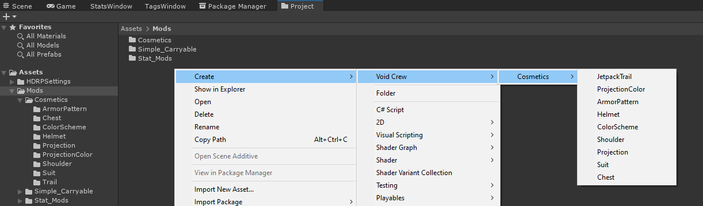
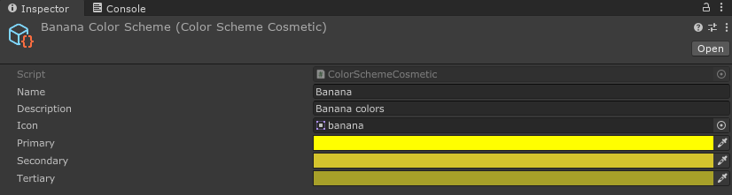
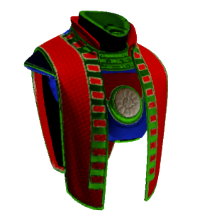
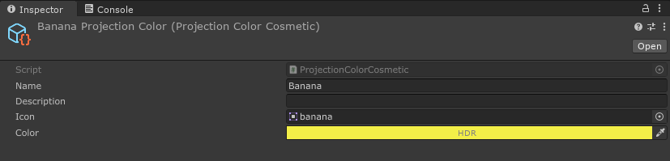

# Cosmetic Colors
These are probably the simplest cosmetics you can create. Cosmetic colors apply colors on the armor pieces in locations defined by a zone map.

To create an armor color scheme or projection, right click in the project window, and in the menu go to Create > Void Crew > Cosmetics. 
Then select `ColorScheme` or `ProjectionColor`.

This will create a new cosmetic scriptable object for the chosen type.

## Armor Color Scheme
Contains three colors fields which get applied to specific parts of armor pieces.

In-game the colors are usually represented in the palette icon in the following order:

- <code style="color : red">Red</code> - primary (this is where patterns appear too), this usually covers the largest parts of armor cosmetics 
- <code style="color : lightgreen">Green</code> - secondary
- <code style="color : blue">Blue</code> - tertiary, usually used for embellishments or decorative elements

For example, this is how the Proctorship Vestment’s zones look like:

## Projection Colors
Contains one color field which determines the color of the projection. 
Note that this is an **HDR** color, which allows you to increase how emissive the color is in post processing. 

