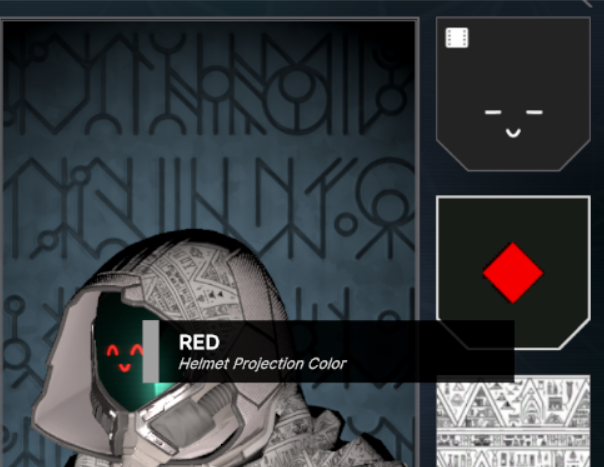

# Helmet Projections
Projections are textures that are projected onto the helmet's projection material.

To create an armor color scheme or projection, right click in the project window, and in the menu go to Create > Void Crew > Cosmetics.
Then select `Projection`.

This will create a new cosmetic scriptable object for the chosen type.

Projection textures should be at least 512x512 in resolution, for standard quality.

They are black and white, where true black (0, 0, 0) or transparent values are used for transparency.

You can use other colors too, but keep in mind that it gets multiplied by the projection color. 
So anything non-white gets mixed and might end up looking different than expected.

**Important**: By default projections get clamped, so make sure to keep the edges black/transparent, at least 5 pixels wide for safety on each side.
Otherwise the projection might repeat from the opposite side.