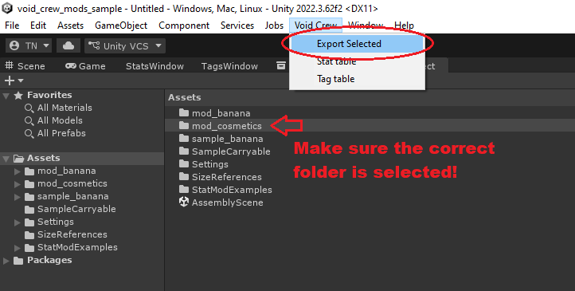
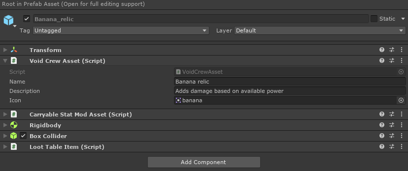
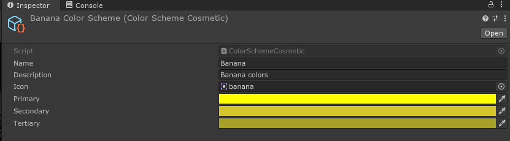

# Asset Bundle Creation

In your Unity Void Crew Samples Project, you can find various example assets. 
These are added to the game at runtime by exporting them as **Unity Asset Bundles**.

Each asset bundle will need to be located in its own folder, which must contain all dependencies (textures, meshes, audio, prefabs).
What this means is that everything referenced by your assets (textures, materials, etc.) must be in within the folder for that asset bundle. 
No references to outside that folder will be kept when exported.

You can include multiple assets per asset bundle. Each prefab you want your mod to load at runtime must have the **Void Crew Asset** component at its root.

To export your asset:
1. Select the folder containing the asset and its dependencies (such as "mod_banana")
2. In the toolbar at the top of Unity, select "Void Crew" and in the dropdown press Export Selected

You will find your exported asset at the root of your Unity Project folder, in a folder named "Exported Assets". 
There will be two files named after the folder you used to export the asset, one with a ".manifest" filetype. 
Only the one _without_ the ".manifest" filetype is needed.

_Note: if you do not see the ".manifest", [you need to enable file extensions in Windows explorer](https://support.microsoft.com/en-us/windows/common-file-name-extensions-in-windows-da4a4430-8e76-89c5-59f7-1cdbbc75cb01#id0ebf=windows_11)._

## Size References
If you want to create your own 3D assets, you will likely want some references for shape and scale. \
[In the sample project](https://github.com/HutlihutGames/void_crew_mods_sample/tree/master/Assets/SizeReferences) 
we have included reference FBX files that you can use in for example Blender and Unity. 

## Void Crew Asset
This is the base component needed for the asset to be loaded into the game. It has the following fields:
- **Name**: Name of the Asset
- **Description**: Description of the asset
- **Icon**: Icon for the asset. The icon's `Texture Type` should be set to `Sprite (2D and UI)`.

These fields are used to populate the asset's Context Info in the game. Context info is the data structure used to fill out the tooltips you see when looking at items or hovering over them in UI.

**Note for Cosmetics**: Cosmetics use scriptable objects instead of prefabs for the assets. So the above fields are found on the cosmetic objects themselves instead of the Void Crew Asset component.

You can include rich text tags in the name and description to add additional styling.
Check [this link](https://docs.unity3d.com/2022.3/Documentation/Manual/UIE-supported-tags.html) to see supported rich text tags for our version of Unity.

## Never modify examples
It is **IMPORTANT** that when you make **new** assets that you either:
- Duplicate another asset and work on the duplicate
- Make a new asset from scratch, and add the necessary components if it is not a scriptable object.

**Never** make your assets by modifying other examples or templates provided by us or other modders.
Doing so will mean they have the same ID (GUID) in their metadata, which will cause problems for Void Crew loading
the assets. 

By duplicating or making the asset from scratch a new ID will be generated automatically, which ensures your assets will
not conflict with assets created by others. Additionally, by ensuring your assets keep a unique ID you will also be able
to update the mod with the assets and the game to still know it is the same asset (so for example cosmetics stay equipped).

## Types of Void Crew Asset Bundles
You can read more about how to create different types of asset bundles in the below chapters.

**[Carryables](../Carryables/Carryables.md)**
Learn about how to create custom weapon mods and relics.

**[Cosmetics](../Cosmetics/Cosmetics.md)**
Learn about how to create custom cosmetics.