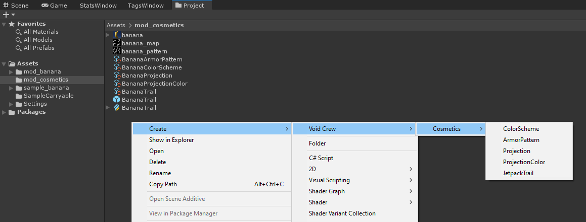

# Custom Cosmetics
Cosmetics are created as Scriptable Objects. You can see examples of custom cosmetics in the mod_cosmetics folder [of the sample project](https://github.com/HutlihutGames/void_crew_mods_sample/tree/master/Assets/mod_cosmetics)

To create new cosmetic objects, use the context menu by right clicking an empty space in the project panel and use the menu to create the type of cosmetic asset you need:

**WIP SECTION**

## Armor Patterns

## Projections

## Projection Color

## Color Schemes

## Jetpack Trails

## Helmets

## Suits

## Shoulder Plates

