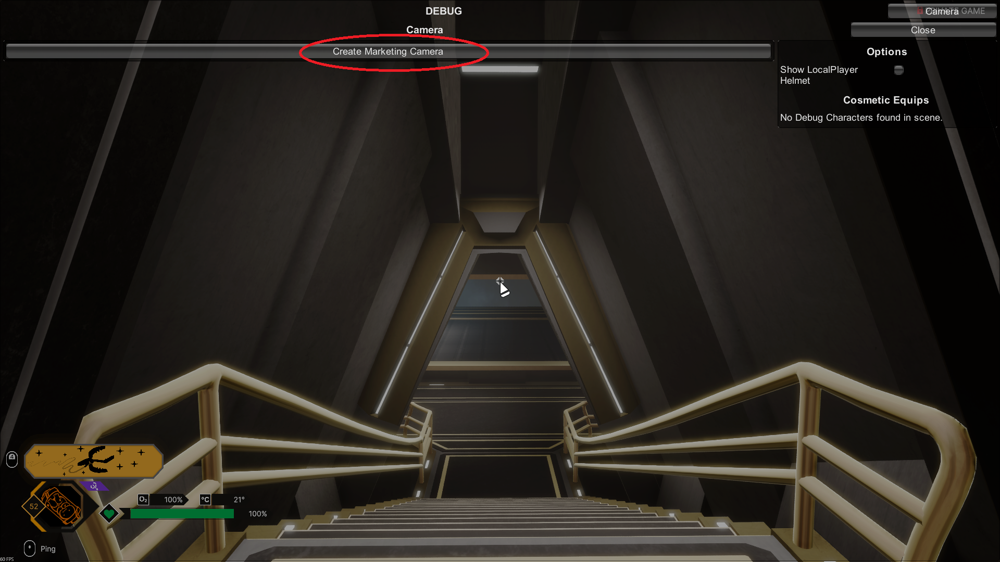
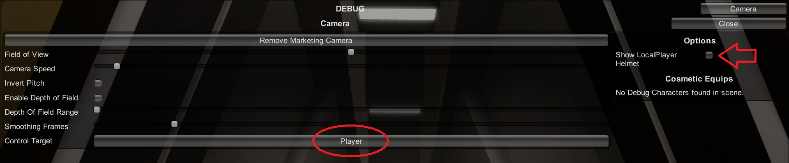
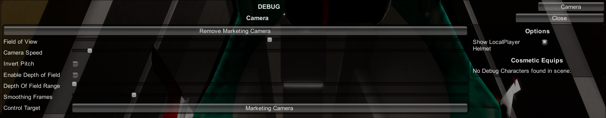
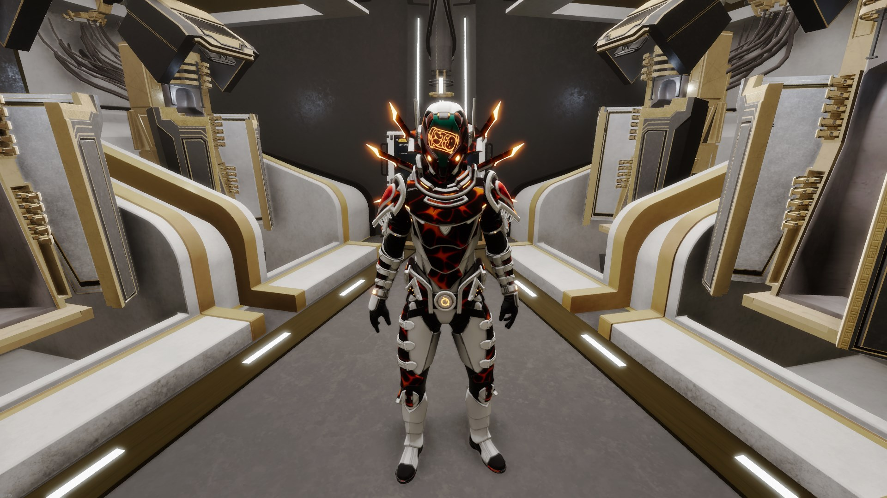

# Debug Camera

Void Crew has a debug camera (also called the Marketing Camera) that you can activate in-game via a hidden shortcut.

This is a technical tool that Void Crew uses internally for marketing purposes, which has been exposed to players with the 1.3.0 update.

You can use this camera to for example:
- View your cosmetics in third person from various angles, without needing a second player.
- Make nice screenshots or recordings.

To open the debug camera menu press: CTRL+ALT+M

```{note}
Some keyboards might not be able to do the key combination in that order. The order of the keypresses don't matter. ALT+M+CTRL will for example also work.
```

You should now see the following menu



Press the **Create Marketing Camera** button. This will expand the menu and give you the following:



Press the **Control Target** button (says "Player") to start with. This button changes your controls from controlling the player to controlling the camera.

```{note}
Due to a technical limitation when using keyboard the "Player" control target will control both the camera and the player at the same time.
To control only the player, you need to connect and use a controller.
```

Then use the **Show Local Helmet** toggle to enable your own helmet. By default, your own helmet is hidden so you down see the model from the inside. 

```{hint}
When done using the camera, use the toggle to hide your helmet again.
```

You should now have the following state in the menu:



Use the shortcut again to close the menu, and you should be able to move the camera around freely.



```{note}
The controls for the camera has a unique setup and will not reflect any custom keybind changes for movement.  
```