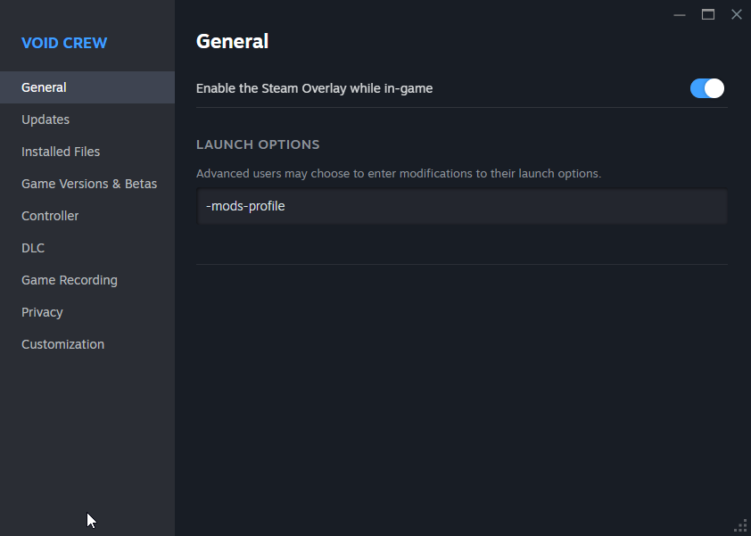

# Getting started

## Mod Profile
To avoid messing with your normal Void Crew profile while using or testing mods, you can use a separate Void Crew mod profile.

You can enable the mod profile by adding the following launch option to Void Crew on Steam:
`-mods-profile`

Automated switching to modded profile to be implemented later.

## Mod Manager
First thing its important to know how mods are installed for Void Crew. 
You will also need a Mod Manager for testing your mods locally for testing.

Void Crew Mods are primarily distributed via [Thunderstore](https://thunderstore.io/c/void-crew/?included_categories=705&section=mods&ordering=top-rated)

1. Install a Mod Manager. We recommend either [Gale](https://kesomannen.com/gale) or [R2ModMan](https://r2modman.com/download-v3-2-9/) as they have good support for installing locally built mods.
2. With your chosen Mod Manager, install [VoidManager](https://thunderstore.io/c/void-crew/p/NihilityShift/VoidManager/). This is a community driven mod that has become the foundation behind Void Crew Modding, which we recommend all modders utilize.
3. Test installing any published community mod. When playing modded Void Crew, you need to launch the game via the Mod Manager.

## Installing Unity
Installing the Unity Editor is required for exporting custom content (asset bundles) for the game. 
We recommend using the same version as Void Crew, which currently uses **Unity Editor 2022.3.62f2**. 
1. Install [Unity Hub](https://unity.com/download), if not already installed. If you do not have a Unity account, you can create a free one. 
2. While you have Unity Hub open, use [this link](https://unity.com/releases/editor/whats-new/2022.3.62f2) to install the editor. You do not need to tick any of the optional modules for the install.

## Installing Git
We highly recommend using a Git client. This will allow you to roll-back to previous versions and easily manage changes you make.
This will also allow you to easily clone the [Void Crew Common Library](https://github.com/HutlihutGames/void_crew_common) and Void Crew Samples Project, as well as update them as we add more official tools.

Our recommended Git client is [Fork](https://git-fork.com/) (free), but you can use any you are comfortable with.

## Setting up the Void Crew Samples Project
Next, you will want to setup a clone of the Void Crew Samples Project. 
This template includes useful samples for getting started, and already includes the [Void Crew Common Library](https://github.com/HutlihutGames/void_crew_common).

1. Use your chosen Git client to clone the [void_crew_mods_sample](https://github.com/HutlihutGames/void_crew_mods_sample) repo
2. In Unity Hub, press "Add" and select the folder containing the Void Crew Samples Project

## Other Tools
### 3D Assets
If you plan on including new 3D assets in your Mod, we recommend installing [Blender](https://www.blender.org/).
Blender will allow you to create custom 3D assets. 

It is also possible you will be using 3D assets made by others found on the internet. 
In that case Blender will also be a useful tool for modifying those assets, or converting them to FBX format for use in Unity. 

You can find example 3D assets in the samples project. This also includes simple scale models, so you can make the models fit neatly into our various socket shapes in the game.

### Images and Sprites
If you're making new 3D assets you'll likely also need to create new textures and sprites for UI icons.
Some free editors include: [Paint.Net](https://www.getpaint.net/), [GIMP](https://www.gimp.org/) and [Krita](https://krita.org/en/)