# Tutorial: Simple Weapon Mod

In this tutorial, you'll be guided through how to create a simple weapon mod with stat modifiers.

You do not need to know how to code for this guide.

By the end of this page, you will have exported one or more `.metem` files that can be tested in Void Crew.

```{note}
This page is intentionally beginner friendly. Some steps may feel obvious if you already know Unity, but they are included for readers who are opening Unity for the first time.
```

If you haven't made one already, you'll need to [create a mod folder within Unity](TutorialFirstMod.md#create-a-folder-for-your-mod).

You'll need a model for the carryable model of your weapon mod.
For simplicity's sake, we'll just use [the size reference model available in the sample project](https://github.com/HutlihutGames/void_crew_mods_sample/blob/master/Assets/SizeReferences/Weapon_Mod_SizeRef.fbx).

Add your model file to your mod folder in Unity.

## Create a prefab for the weapon mod

- In the **Hierarchy window**, right click and create an empty GameObject.

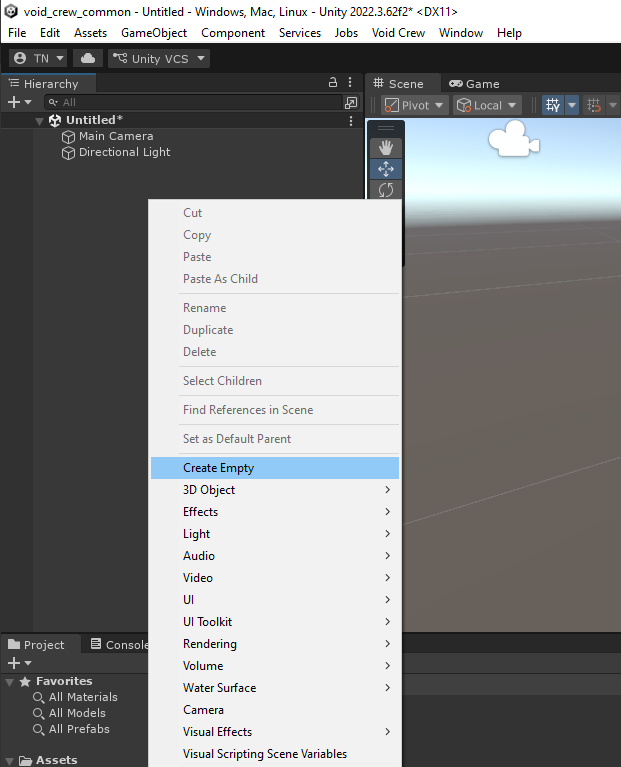

- Select the GameObject in the **Hierarchy window** and go to the **Inspector window**
- Give the GameObject a name, such as "My Weapon Mod"
- Reset the Transform component of the GameObject, to ensure it has no weird offset.

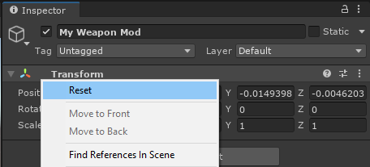

- Drag and drop the GameObject from the **Hierarchy window** to the **Project window** inside your mod folder. This will turn it into a Prefab.

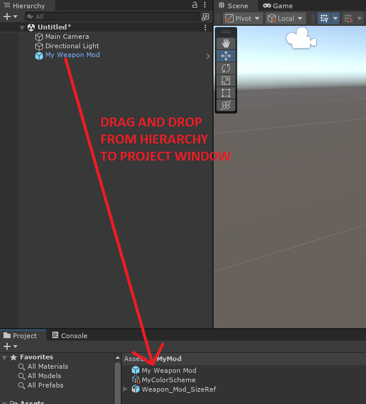

```{hint}
Prefabs are reusable GameObjects. This means you can open the base prefab and make changes to it, that will apply to every instance of the prefab. If you make changes to the prefab from the scene they will be "overrides" to the base prefab.
```

When you select the GameObject you'll now notice the inspector looking a little different because it is now a prefab.

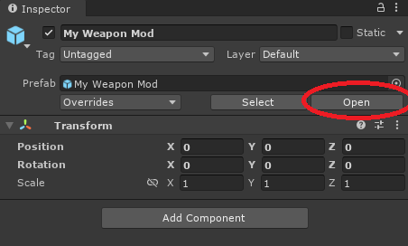

- Press the button to open the Prefab.
    - Alternatively, you can also double click the prefab in the **Project window**
- Drag and drop your model into the prefab.


- Select the model object in the **Hierarchy window** and set the X rotation to -90 relative to the parent.

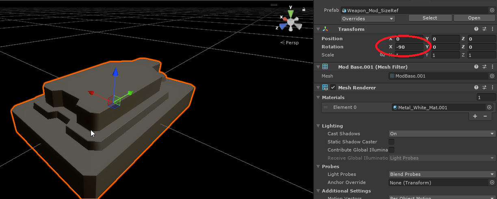

The reason this needs to be done is because the pivot points on the weapon mod slots are rotated so that the X axis points towards the ceiling, and Y axis points towards the player.

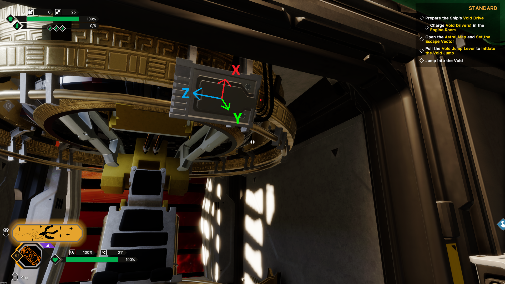

## Add Components
Next you'll need to add a few components to the root of the prefab.
- Select the root of the prefab

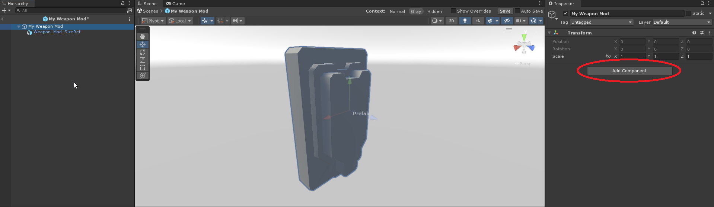

Add the following components:
- Void Crew Asset (needed for all carryables)
- Carryable Stat Mod Asset (makes the carryable able to modify stats of other things)
- Craftable Item (makes it possible to craft the item)
- Loot Table Item (makes it possible to acquire the item via loot drops)
- Rigidbody (adds physics to the carryable)
- Box Collider (adds collision to the carryable)

Next we'll need to fill out the different components.

- Give the carryable a name, description and an icon
    - Remember the icon asset also needs to be placed inside your mod folder.

(Your icon doesn't have to be a fancy transparent clipart, it can also be a simple screenshot of the model)

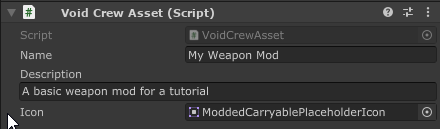

- Add the Box Collider to the Override Collider field
- Add the renderer of your model to the Override Renderer

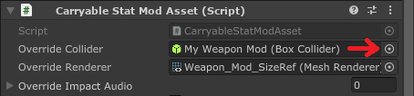

```{hint}
If you were making a relic instead, you'd need to tick the "Is Relic" box. 
```

- Add the json data for the stat modifiers you want the weapon mod to have.

For the tutorial's sake, you can try using this simple json block for buffing damage by 40% and decreasing fire rate by 20%.

```json
{
  "modifiers": [
    {
      "name": "Damage",
      "type": "AdditiveMultiplier",
      "amount": 0.4
    },
    {
      "name": "FireRate",
      "type": "AdditiveMultiplier",
      "amount": -0.2
    }
  ]
}
```

You can find lots of examples for stat modifier json data in the [StatModExamples folder](https://github.com/HutlihutGames/void_crew_mods_sample/tree/master/Assets/StatModExamples) in the sample project.

You can later read more about stat modifiers and how they work [here](../StatModifiers/StatModifiers.md).

Setup the crafting data if needed
- Can be advantageous to set the cost to 0 for testing purposes.

Setup the loot data
- Add an entry in Sector Completion reward if you want the the weapon mod to appear via METEM Supply Drops
    - Set weight to 1 if you want it to appear at the same rate as most other items, or higher if you want it to appear more.
    - Set amount to 1
    - Add a chapter entry and leave the value at 0 if you want it to appear before the first boss, or to 1 if you want it to appear only after the first boss
    - Set which encounter difficulties the item can appear in as a supply drop
- Add a drop table entry if you want the weapon mod to drop from enemies or appear in chests
    - Set amount to 1
    - Set the rarity type of the weapon mod
    - Set the drop location to **Floating**
    - Set the drop category to **On Death Pilgrimage** (this makes it appear as regular drops by enemies in Pilgrimage)
        - You can read more about the different drop tables [here](../Carryables/Carryables.md#drop-table-entries).

Edit size and offset of the Box Collider to match the model of the carryable.
Since we're making a weapon mod, the following works well:
- Offset: 0x, 0.02y, 0z
- Size: 0.3x, 0.15y, 0.5z

When done you should see a collider like so when selecting the root of the prefab:

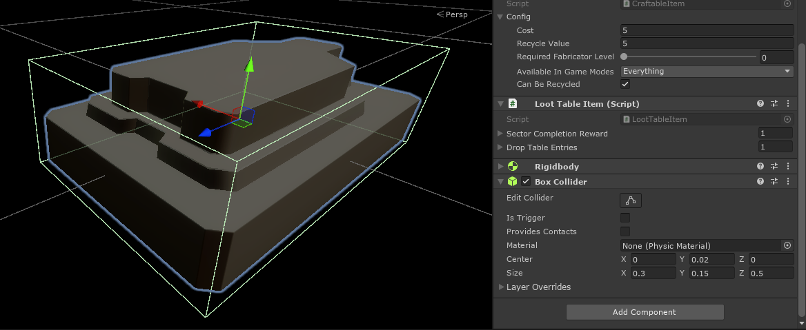

Note that nothing needs to be changed on the RigidBody component.

Remember to save your prefab when done!
You can press CTRL+S or use save button under the **Scene window**. Here you can also find a toggle for auto save.

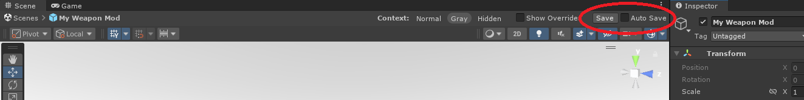

From here, the steps to export your weapon mod are the same as in the [previous tutorial](#export-the-asset-bundle).

## Export the asset bundle
- In the **Project window**, select your mod folder (not via the tree view on the left side).


- In the Unity toolbar, open the Void Crew dropdown
- Select **Export Selected**

Unity will create an Exported Assets folder at the root of your Unity project,
and open the folder automatically after exporting is done.

In the Exported Assets folder, there will be two files named after your mod folder: the one with the `.metem` file type is what you need to test your mod in-game.

_Note: if you cannot tell the files apart, [you need to enable file extensions in Windows explorer](https://support.microsoft.com/en-us/windows/common-file-name-extensions-in-windows-da4a4430-8e76-89c5-59f7-1cdbbc75cb01#id0ebf=windows_11)._

To test the mod immediately:
- Go to your Void Crew install folder (the same folder that has Void Crew.exe).
    - Open install folder via Steam: Right click on Void Crew > Manage > Browse Local Files.
- If there is no "Mods" folder already, create one.
- Copy your `.metem` files to the Mods folder. The game will natively try to load any `.metem` files placed in this folder.

In-game, you can test your carryable by making it in the fabricator. 
Alternatively, you can also use the [community debug tools mod](../ModCreation/TestingModsLocally.md#testing-carryables) to directly spawn your carryable.

This is just a simple export for quickly testing your modded asset.
For publishing, you will want to also add a [Mod Descriptor](../ModCreation/ModDescriptor.md) asset to your mod folder.
Go to [this guide](../ModCreation/AssetMods.md) for how to export your mod for mod managers and [this guide](../ModCreation/UploadingMods.md) for uploading on ThunderStore.
