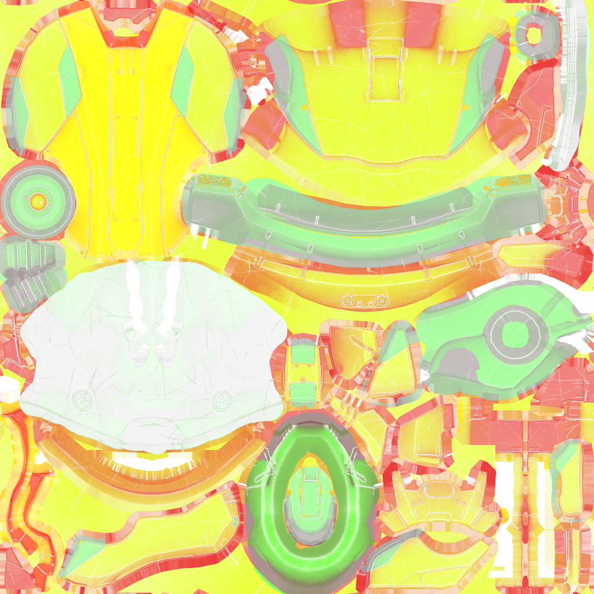
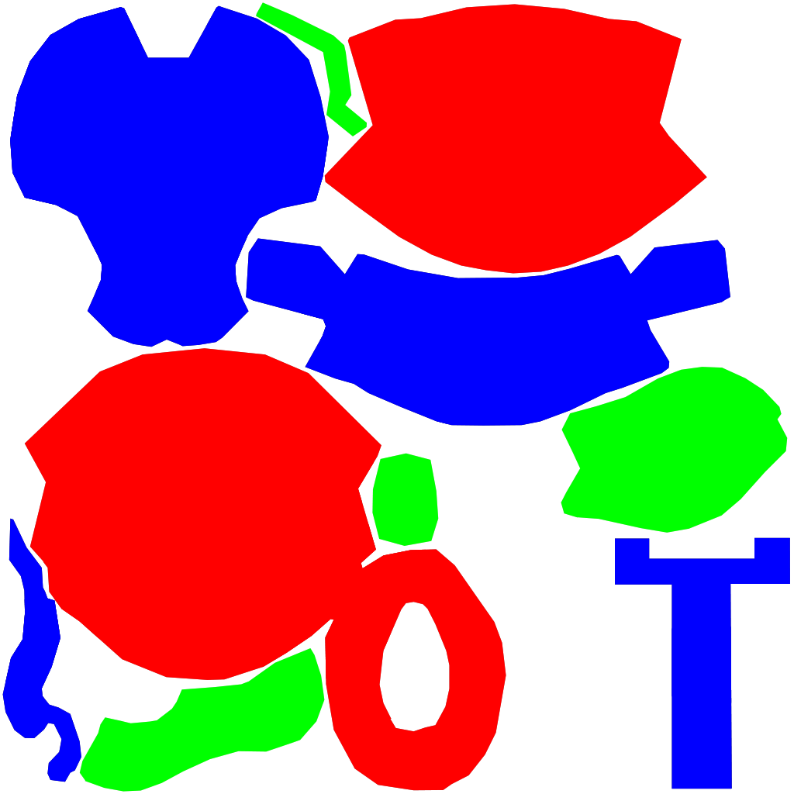
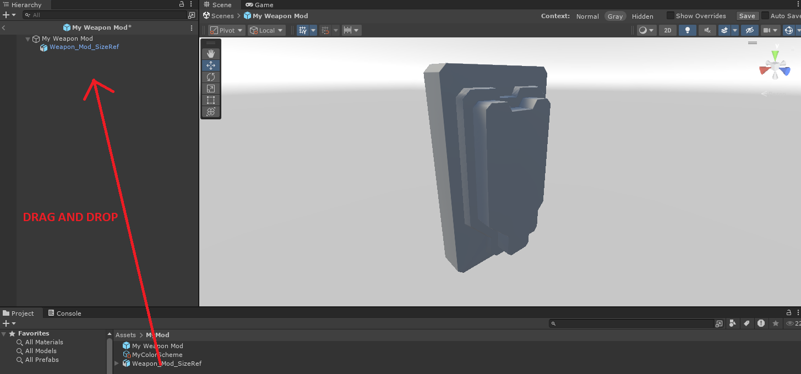
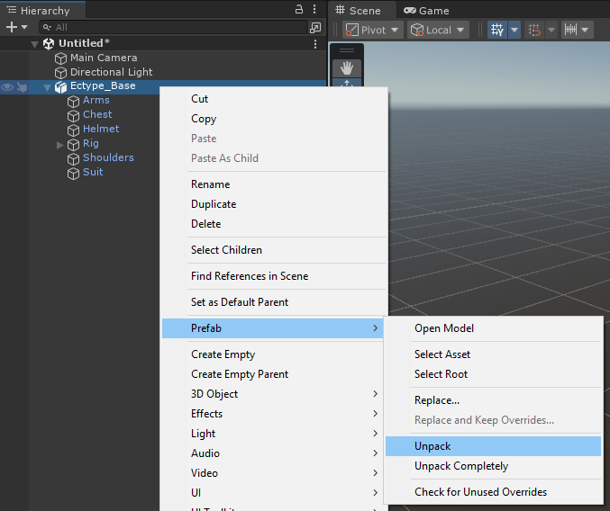
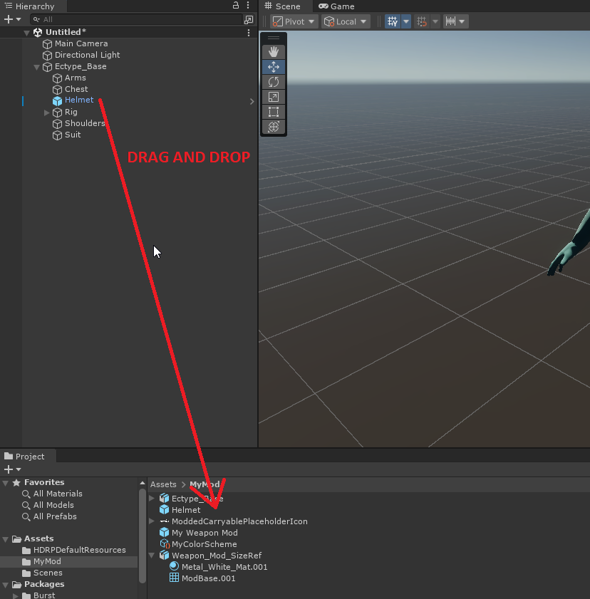
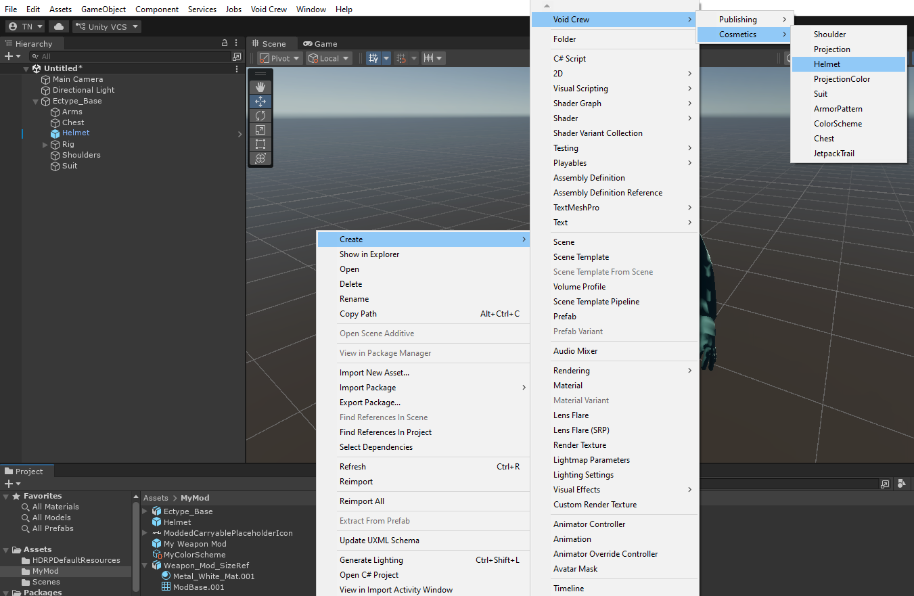
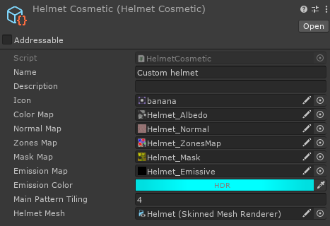
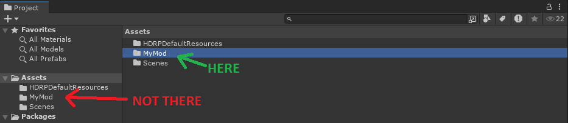

# Tutorial: Cosmetic Helmet
In this tutorial, we will create a wearable helmet cosmetic from a 3D model. Most of the steps involved will be the same or similar for other wearable cosmetics as well.

You do not need to know how to code for this guide. Some Blender or 3D modelling knowledge is recommended.

By the end of this page, you will have exported one or more `.metem` files that can be tested in Void Crew.

```{note}
This page is intentionally beginner friendly. Some steps may feel obvious if you already know Unity, but they are included for readers who are opening Unity for the first time.
```

## Preparing Your Model

```{note}
Implementing a cosmetic into a Void Crew mod is easy: the hardest part is making the model or preparing an existing model.
```

You can use a model you made yourself, or a model downloaded from the internet. Make sure you have permission to use and redistribute the model if you plan to publish your mod.

- Find or make a helmet model that you'd like. You can find many free helmets online, for example on [Sketchfab](https://sketchfab.com/search?features=downloadable&licenses=7c23a1ba438d4306920229c12afcb5f9&licenses=322a749bcfa841b29dff1e8a1bb74b0b&q=space+helmet&type=models)
    - If you find a helmet online, it is possible that you will need to do some extra work in Blender to make it compatible with Void Crew.

For the model to be Void Crew ready it should ideally:
- Use a single material slot (or two if a projection compatible helmet)
- Have textures for the base color, and optionally also normal maps, metallic, smoothness, ambient occlusion and emission.

```{hint}
Base color texture is sometimes also referred to as "Diffuse" or "Albedo". 
```

You'll likely need to make the mask map texture yourself, by combining metallic, smoothness and ambient occlusion textures.
If the model has a roughness texture instead of smoothness, then just invert the texture.

```{note}
All the armor pieces must be setup so that they only have 1 material slot, which covers the whole mesh (helmets have a second slot for projections).
If you are downloading a model from the internet, we therefore recommend finding a model that is already setup to use one material. 
We plan on expanding this functionality in the future so more complex material setups are supported, and so it becomes easier to implement modded models from various origins. 
```

The process for preparing your model will differ a lot depending on the state you found the model in, unless you made it yourself.
We won't cover all the possible steps for that here, but since they'll likely be generic Blender specific processes, you should be able to find tutorials on for example Youtube to cover anything you need.

Instead we'll keep focusing on the Void Crew modding specific steps.

The part of the process that will be needed for every wearable cosmetic is skinning the model to the character rig.
This is the process that will make the cosmetic move with the correct bones on the character.
You can read about how to do that in our [Skinning Guide](../Cosmetics/SkinningGuide.md).

We recommend exporting the model into FBX format from Blender, for better Unity compatibility.

It is also recommended to export the cosmetics together with the whole rig, as that makes the setup within Unity a bit easier.

## Textures
If you don't have all the textures needed, you can create the other textures based on the base color texture.
[Materialize](https://www.boundingboxsoftware.com/materialize/) by Bounding Box Software is a great free tool for this.

To create the mask map, you can use an image editing tool such as [GIMP](https://www.gimp.org/) to combine the metallic, smoothness and and ambient occlusion textures into one image across different color channels:
- Red → Metallic
- Green → Ambient Occlusion
- Alpha → Smoothness

A mask texture will for example look like this:


Then you'll also want to create a zone map to define where armor patterns will be shown, and which armor colors are applied where.
This is done by coloring your texture in full pure red, green and blue colors (or black to make certain bits unaffected).
- <code style="color : red">Red</code> - primary (this is where patterns appear too), this usually covers the largest parts of armor cosmetics
- <code style="color : lightgreen">Green</code> - secondary
- <code style="color : blue">Blue</code> - tertiary, usually used for embellishments or decorative elements
- Black - Keep the color coming from the Base Color texture

A finished zone map texture will for example look like this:


## Setup your Model in Unity

- Add your model file to your mod folder.

Some simplicity's sake, we'll reference how to setup a helmet like the [example helmet in the sample project](https://github.com/HutlihutGames/void_crew_mods_sample/tree/master/Assets/Mods/Cosmetics/Helmet).
So we will add the [Ectype_Base.fbx](https://github.com/HutlihutGames/void_crew_mods_sample/blob/master/Assets/Mods/Cosmetics/Ectype_Base.fbx) to the folder in this tutorial.

- Drag and drop the model file into the hierarchy
- Expand the GameObject to see child objects. In there you will see all your cosmetics



- Right click on the model's gameobject where you see the blue box icon
- In the context menu go to Prefab > Unpack



- Drag and drop your helmet into your mod folder to turn it into a Prefab
    - If you have multiple cosmetics on the model you are turning into cosmetics, then you can repeat this process for each one.



Next you'll need to create the helmet cosmetic data asset.

- In the **Project window**, right click to open the context menu
- Go to Create > Void Crew > Cosmetics > Helmet



- Add a name and icon for you helmet
    - The icon can be a simple screenshot of the helmet
- Add your textures to each respective field.
    - Color Map is strongly recommended for the base texture. The others are optional, but still recommended.
    - Remember to make sure each texture is located somewhere within your mod folder.
- Set an emission color if you are using an emission map.
- Set how much armor patterns should tile onto the primary zone of your cosmetic. A higher value will make the pattern appear more "zoomed out".
- Drag and drop the helmet prefab we created earlier into the **Helmet Mesh** field. This should assign the Skinned Mesh Renderer included in the prefab.



Your helmet cosmetic is now ready for export!

## Export the asset bundle
- In the **Project window**, select your mod folder (not via the tree view on the left side).



- In the Unity toolbar, open the Void Crew dropdown
- Select **Export Selected**

Unity will create an Exported Assets folder at the root of your Unity project,
and open the folder automatically after exporting is done.

In the Exported Assets folder, there will be two files named after your mod folder: the one with the `.metem` file type is what you need to test your mod in-game.

_Note: if you cannot tell the files apart, [you need to enable file extensions in Windows explorer](https://support.microsoft.com/en-us/windows/common-file-name-extensions-in-windows-da4a4430-8e76-89c5-59f7-1cdbbc75cb01#id0ebf=windows_11)._

To test the mod immediately:
- Go to your Void Crew install folder (the same folder that has Void Crew.exe).
  - Open install folder via Steam: Right click on Void Crew > Manage > Browse Local Files.
- If there is no "Mods" folder already, create one.
- Copy your `.metem` files to the Mods folder. The game will natively try to load any `.metem` files placed in this folder.

This is just a simple export for quickly testing your modded asset.
For publishing, you will want to also add a [Mod Descriptor](../ModCreation/ModDescriptor.md) asset to your mod folder.
Go to [this guide](../ModCreation/AssetMods.md) for how to export your mod for mod managers and [this guide](../ModCreation/UploadingMods.md) for uploading on ThunderStore.

If you want to create other types of wearable cosmetics, then the process will be mostly the same.
You can read about the differences between each type on our [Armor Pieces](../Cosmetics/ArmorPieces.md) page.