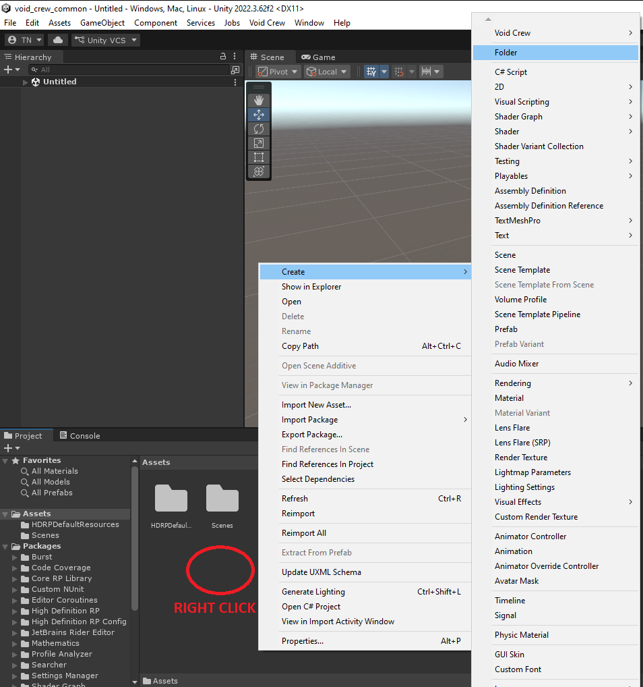
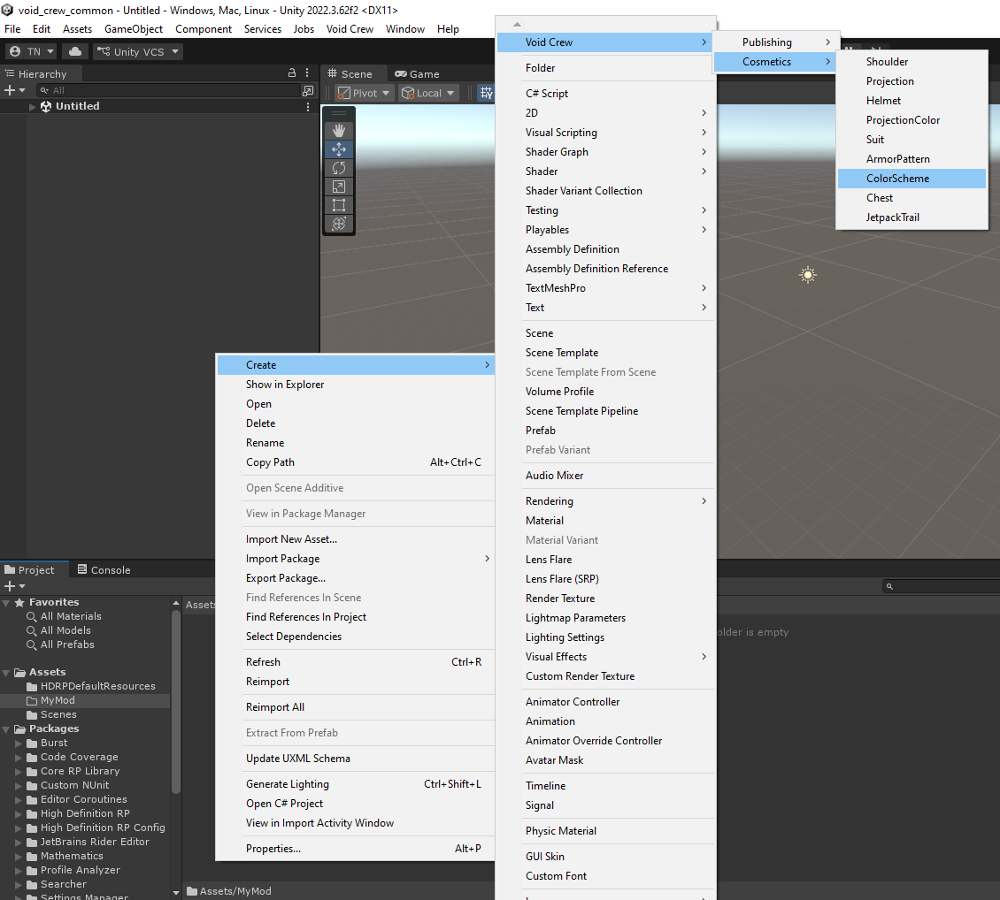
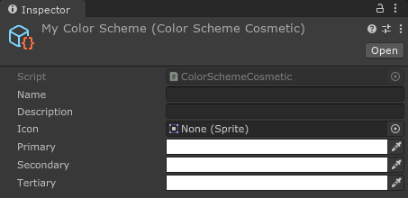
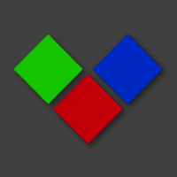

# Your First Mod
This guide walks you through creating your first Void Crew mod inside Unity.

You do not need to know how to code for this guide. We will start with the smallest possible mod: a cosmetic color scheme. After that, we will make a simple helmet cosmetic, then a carryable item that can be crafted in the fabricator.

By the end of this page, you will have exported one or more `.metem` files that can be tested in Void Crew.

```{hint}
If you have not set up Unity yet, follow the Getting Started guide first.
```

```{note}
This page is intentionally beginner friendly. Some steps may feel obvious if you already know Unity, but they are included for readers who are opening Unity for the first time.
```

## Your first Mod: Cosmetic Color Scheme
In this first tutorial, we will create a simple cosmetic color scheme.
This is a good first mod because it only uses data you can define in Unity, no models required.

**1. Create a folder for your mod**

- In Unity, go to the **Project window**.
- Create a new folder under **Assets**.
- Name it something clear to represent your mod, such as "My_First_Color_Scheme".



We'll refer to this folder as the "mod folder" from here on.

```{important}
Keep all assets used by the mod inside the mod folder. When you export the mod later, all dependencies must be inside the selected folder. If a texture, material, prefab, or other dependency is outside the folder, it may not be included correctly.
```

**2. Create the color scheme asset**

- In the **Project window**, enter your mod folder if you haven't already.
- Right click an empty space within the project window. This should open a large context menu.
- Select **Create > Void Crew > Cosmetics > Color Scheme**
- Name the new asset



**3. Fill out the scheme information**

- Select your new color scheme asset
- In the **Inspector window**, give the color scheme a name. This is the name displayed in-game.
- You do not need to add a description.
- Add an icon for representing your color scheme in UI. Make sure the icon is also placed within your mod folder.
- Define primary, secondary, and tertiary colors. These are the colors that will be applied to the armor.



You can use the below image as a template for the icon, 
if you want it to match Void Crew's existing color scheme icons. 
The icon template is also available on the sample project [here](https://github.com/HutlihutGames/void_crew_mods_sample/blob/master/Assets/CosmeticsHelpers/icon-color-scheme-template.png).



- <code style="color : red">Red</code> - primary (this is where patterns appear too), this usually covers the largest parts of armor cosmetics
- <code style="color : lightgreen">Green</code> - secondary
- <code style="color : blue">Blue</code> - tertiary, usually used for embellishments or decorative elements

**4. Export the color scheme**
- In the **Project window**, select your mod folder (not via the tree view on the left side).


- In the Unity toolbar, open the Void Crew dropdown
- Select **Export Selected**

Unity will create an Exported Assets folder at the root of your Unity project, 
and open the folder automatically after exporting is done.

In the Exported Assets folder, there will be two files named after your mod folder: the one with the `.metem` file type is what you need to test your mod in-game.

_Note: if you cannot tell the files apart, [you need to enable file extensions in Windows explorer](https://support.microsoft.com/en-us/windows/common-file-name-extensions-in-windows-da4a4430-8e76-89c5-59f7-1cdbbc75cb01#id0ebf=windows_11)._

To test the mod immediately:
- Go to your Void Crew install folder (the same folder that has Void Crew.exe).
    - Open install folder via Steam: Right click on Void Crew > Manage > Browse Local Files.
- If there is no "Mods" folder already, create one.
- Copy your `.metem` files to the Mods folder. The game will natively try to load any `.metem` files placed in this folder.

This is just a simple export for quickly testing your modded asset.
Go to [this guide](../ModCreation/AssetMods.md) for how to export your mod for mod managers and [this guide](../ModCreation/UploadingMods.md) for uploading on ThunderStore.

## Your first Cosmetic: Helmet


## Your first Carryable: Simple Relic


