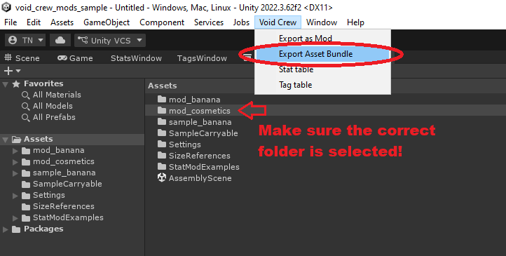
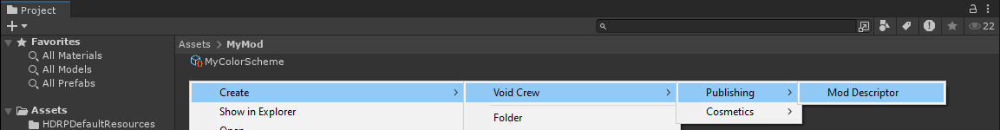
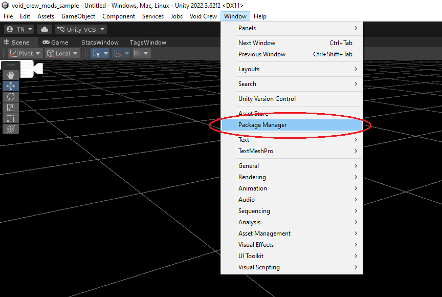
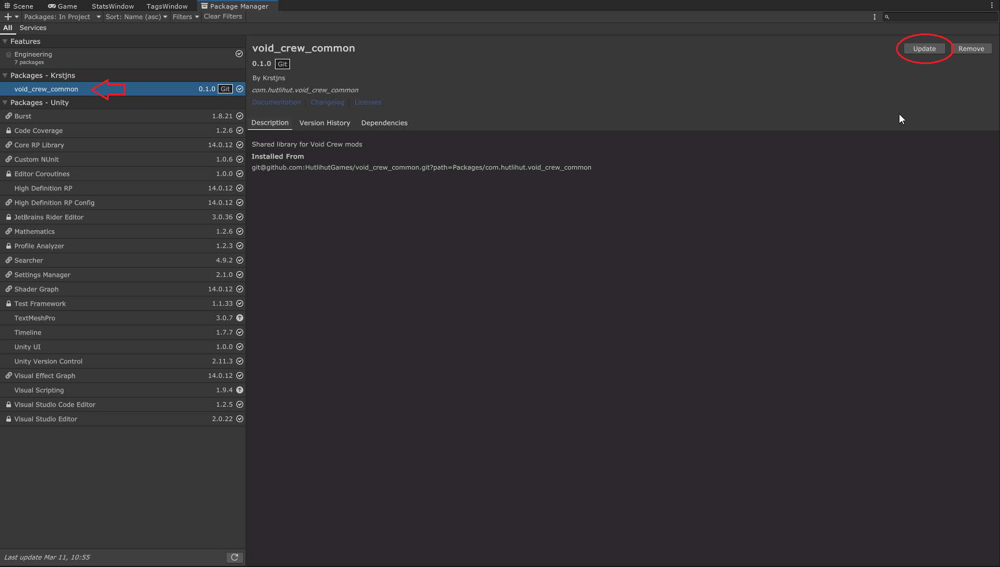

# Asset Bundle Mods
This guide covers how to publish a mod that purely contains custom asset bundles, without having to write and compile any code yourself. 
So this is sufficient if your mod only contains asset types that Void Crew natively supports loading via `.metem` files, such as Cosmetics, Void Crew assets (carryables), and Ship Visuals.

Asset bundles are files exported via Unity, which Void Crew can load at Runtime. Void Crew uses the `.metem` file format when looking for asset bundles.

Each asset bundle will need to be located in its own folder, which must contain all dependencies (textures, meshes, audio, prefabs).
What this means is that everything referenced by your assets (textures, materials, etc.) must be within the folder for that asset bundle.
No references to outside that folder will be kept when exported.

In the Unity Void Crew Samples Project, you can find [multiple examples](https://github.com/HutlihutGames/void_crew_mods_sample/tree/master/Assets/Mods) of assets that are ready to be exported to `.metem` format. Use these examples as a guide for how to structure an asset bundle folder.

You can include multiple assets per asset bundle. Each prefab you want your mod to load at runtime must have the **Void Crew Asset** component at its root.

## Export Asset Bundles
This export method is used for only exporting your assets to a `.metem` asset bundle. This is useful for when you need to quickly test new iterations of your assets in-game.

To export your assets to a `.metem` asset bundle:
1. Select the folder containing the asset(s) and its dependencies (such as "mod_banana")
2. In the toolbar at the top of Unity, select "Void Crew" and in the dropdown press `Export Asset Bundle`



You will find your exported asset at the root of your Unity Project folder, in a folder named "Exported Assets".
The folder should open automatically after exporting completes.

There will be two files both named after the folder you used to export the asset bundle, with a `.metem` and `.manifest` filetype.

**The `.metem` file is what you need to include in your mod.** The ".manifest" file is not normally needed, but including it should not cause problems either.

_Note: if you cannot tell the files apart, [you need to enable file extensions in Windows explorer](https://support.microsoft.com/en-us/windows/common-file-name-extensions-in-windows-da4a4430-8e76-89c5-59f7-1cdbbc75cb01#id0ebf=windows_11)._

To quickly test the asset bundle in-game without a mod manager, you will need to [put it in a Mods folder](TestingModsLocally.md#testing-asset-bundles-without-a-mod-manager) next to the `Void Crew.exe`.

## Export as Mod
This export method is recommended for when you need to export your assets so they are ready to be loaded by mod managers and published on ThunderStore.

To use this method, you must first create a [Void Crew Mod Descriptor](ModDescriptor.md) and place it within the folder containing your assets.



To export your assets to a mod:
1. Select the folder containing the asset(s) and its dependencies (such as "mod_banana"). The folder must contain a Mod Descriptor.
2. In the toolbar at the top of Unity, select "Void Crew" and in the dropdown press `Export as Mod`

This will create a mod folder with your `.metem` asset bundle and all the necessary files for mod managers and Thunderstore, based on the information in the Mod Descriptor.
The mod folder will be placed within "Exported Mods" folder. The folder should open automatically after exporting completes.

The final step is now to zip the mod folder.
To do this on Windows do the following:
- Right click your mod folder
- Go to "Send To"
- Choose "Compressed (zipped) Folder

Once the folder is zipped, it is ready for either [installing via a mod manager](TestingModsLocally.md#testing-mods-using-mod-manager), or uploading to [ThunderStore](UploadingMods.md).

```{important}
Asset bundles installed via mod managers require BepInEx as a dependency, in forder for Void Crew to know where to look for the .metem files. This dependency is automatically added to your Mod Descriptor by default.
```

# Updating Void Crew Common
If the [Void Crew Common library](https://github.com/HutlihutGames/void_crew_common) is updated by Hutlihut Games, 
you may need to manually update the library in your Unity project. 

The library can be updated in your Unity Project by using the Unity's Package Manager.



In the package manager, find the `void_crew_common` package, and press "Update".

