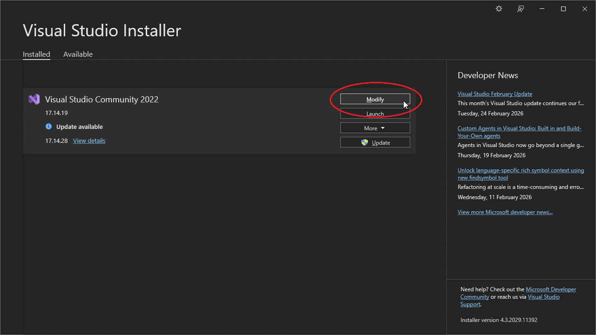
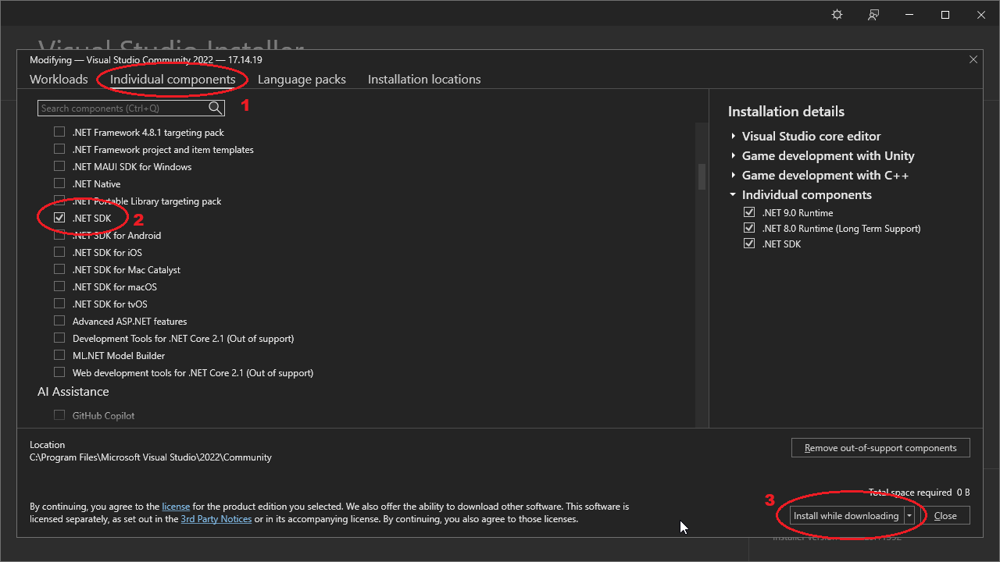
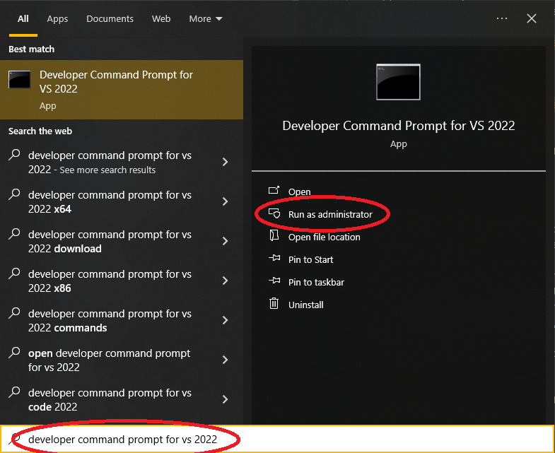
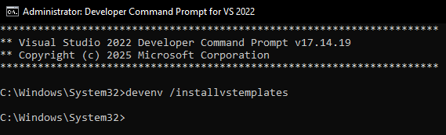
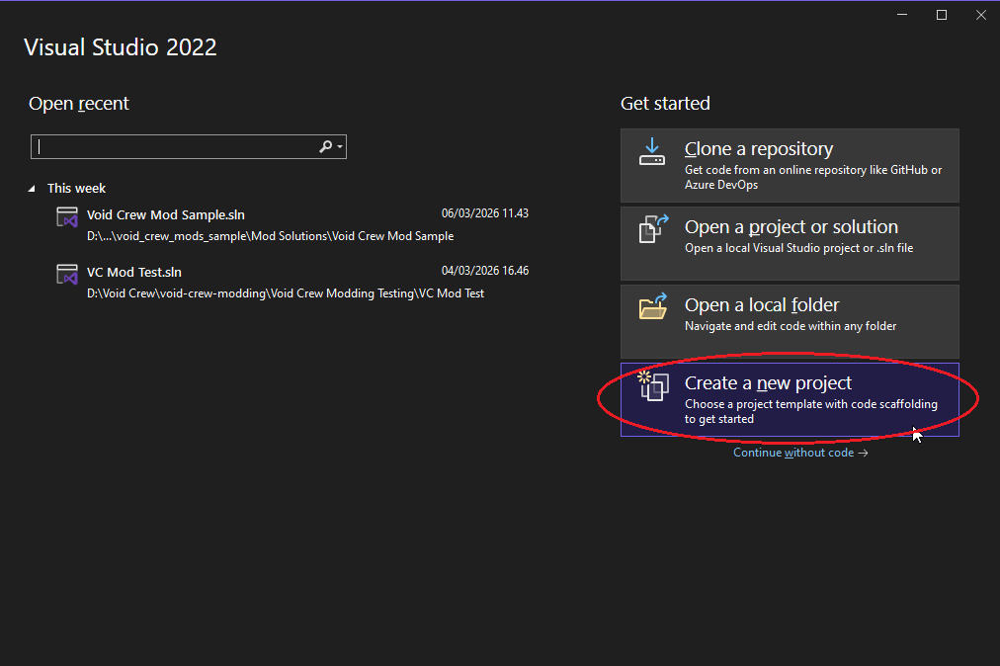
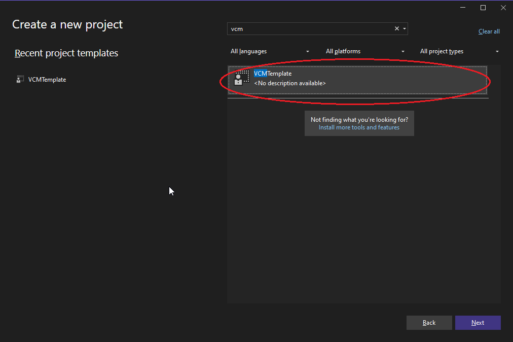

# Compiling Mods
This section covers how to build your own mods with more complex custom functionality using your own code. 
This section is not needed if you only want to make mods that simply contain new assets (See "Asset Mods" chapter).

For more information on how to inject code into Void Crew, see the guide on [Harmony Patching](../ModScripting/HarmonyPatching.md)

## Installing Visual Studio
You will need to install necessary SDKs via Visual Studio in order to compile your mod into a format other players can use.

You don't necessarily have to write your code in Visual Studio. You can use any preferred IDE for that. 
But Visual Studio is recommending for setting up the template, and supports building the mod .dll in case your chosen IDE doesn't.

We recommend using Visual Studio 2022 or later. You can get the newest free version of Visual Studio Community from [here](https://visualstudio.microsoft.com/downloads/).

Once installed, you will need to ensure you have the Microsoft.Net.Sdk installed.
- On Windows, search for and open Visual Studio Installer
- Select _Modify_ on your version of Visual Studio

- Go to _Individual Components_
- Find and tick .NET SDK and install.

## Setting up the Mod Template Solution
You'll need to setup the mod solution, which itself can be compiled into a mod.
This is separate from your Unity Project where you setup the assets, and you'll need a separate mod solution for each mod.

- Get the newest VCM Template. A copy of the template has been provided with the Sample Project [here](https://github.com/HutlihutGames/void_crew_mods_sample/tree/master/Visual%20Studio%20Templates/VCMTemplate).
- Unzip the VCM Template
- Next you'll need to find the user templates location for your version of Visual Studio. If needed you can find where the user template folder location for the newest version of Visual Studio is [here](https://learn.microsoft.com/en-us/visualstudio/ide/how-to-locate-and-organize-project-and-item-templates?view=visualstudio).
  - Visual Studio 2022: `%USERPROFILE%\Documents\Visual Studio <version>\Templates\ProjectTemplates\C#`
    - (Replace `<version>` with your version of Visual Studio. For example: `\Visual Studio 2022\ `)
  - Visual Studio 2026: `%USERPROFILE%\Documents\Visual Studio 18\Templates\ProjectTemplates\C#`
  - Copy the VCM Template folder to the directory

You may need to update the Visual Studio Template Cache before you can proceed.
To do this, open the `Developer Command Prompt` for your version of Visual Studio, and `Run as Administrator`

Once open run the following command: `devenv /installvstemplates` 

Open Visual Studio and choose "Create a new project"

Select the VCM Template

Enter a name for the project (such as the name for your mod) and location.
 - We recommend having a Git repository for your mod project solutions. So the location is not an existing repository, we recommend create a new one from that directory. You can read more about getting started with Git [here](../GettingStarted/GettingStarted.md).

Once the project is created, you can open it with Visual Studio or another preferred IDE to write the C# code for your mod.

You can read more about code patching [here](../ModScripting/HarmonyPatching.md).

### Updating the Solution's Assembly Reference for Void Crew
In the event of an update, you will probably want to update the assembly used by the mod solution. This will allow you to see
the newest assembly code for Void Crew. Depending on the complexity of the mod, you will likely need to do this to maintain the mod and solve conflicts.

- In Visual Studio go to the Solution Explorer, then find: Dependencies > Packages > VoidCrew.GameLibs
- Right click and Open Containing Folder
- From the Containing Folder, open the lib folder
- Then in a separate Explorer Window, go to your Void Crew install location. Then navigate to Void Crew_Data > Managed
- Copy the Assembly-CSharp.dll file. Then paste and override the one in the lib folder
- You may need to restart Visual Studio or other IDE for the Assembly to update

## Compiling your Mod
You will need to compile your mod into a .dll file for it to be loaded into the game via a Mod Manager.

This can be done with Visual Studio, but many other IDEs also support this (For example Jetbrains Rider).

**Building with Visual Studio**:
In the top toolbar, go to "Build" and choose "Build Solution". Alternatively use CTRL+SHIFT+B

**Building with Jetbrains Rider**:
In the top toolbar (may be hidden behind a burger menu in the top left for some layouts), go to "Build" and choose "Build Solution"

After building completes, the result will be put in the `bin\Debug\net472\` folder next to your mod solution file.
In there you will have the compiled .dll file and other files needed for publishing your mod on Thunderstore and viewing it via Mod Managers.
A pre-zipped file of the mod will also be in  the Releases folder.

## Including Asset Bundles with your Mod
The Void Crew Sample Project includes an example solution for showing how you can load asset bundles via your mod [here](https://github.com/HutlihutGames/void_crew_mods_sample/tree/master/Mod%20Solutions/Void%20Crew%20Mod%20Sample)

In the sample solution, you can copy the code in ``ModdedAssetLoader`` into your own mod solution (remember to change the namespace to match your mod).

After compiling your mod, you will then simply need to include the asset bundle file pairs with the .zip file of your mod. 

Note that Mod Managers will unwrap all subfolders in .zip into one directory level. But you can still include subfolders in the .zip for organizational purposes. 