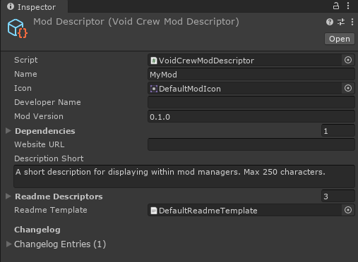

# Mod Descriptor
The Void Crew Mod Descriptor is a special data file containing information on your mod, that mod managers and ThunderStore can use.

To create a mod descriptor, go to the Project tab and right click somewhere within the folder for your mod.

Create > Void Crew > Publishing > Mod Descriptor

Select the mod descriptor and fill out needed/relevant information.

**Name**:
Name of your Mod. Will also be used when exporting your mod.

**Icon**:
Icon for your mod that will be displayed within mod managers and on ThunderStore.
On export, the icon will be formatted and resized to a 256x256 PNG.

**Developer Name:**
Credit yourself!

**Mod Version**:
The version of your mod. It is recommended to increment one of the numbers with each published update.

**Dependencies**:
Other mods that your mod depend on, written in Team-Name-Version format.
Asset bundles loaded via mod managers rely on `BepInEx-BepInExPack-5.4.2100` or later to tell Void Crew where the mod manager installs your mods.
This dependency is automatically added when you create your mod descriptor.

Unless you're an advanced modder, you should not need to add any new dependencies.
_Do not remove the BepInEx dependency unless you know what you are doing._

**Website URL:**
An optional field to provide mod managers with a link to a website for your mod.

**Description Short**:
A description of your mod that is short enough for it to be displayed within a mod manager.
Can be 250 characters at most. The editor will truncate and warn you if you exceed this amount.

**Readme Descriptors**:
Descriptions of your mod that will be copied into README template.
The README is the info that will be shown directly on your mod's page on ThunderStore.

The descriptors are setup so they replace specific tags encapsulated by `{{ }}` in the README template.
You should not change the Descriptor Tags unless you are using a custom template.

**Readme Template**:
A file written in `.md` format which is used to generate the final README file that will be displayed on your mod's ThunderStore page.
We have provided a default standardized template, but you can make your own if you want.

**Changelog**:
Here you can write about what has changed with each version of your mod.
Technically optional, but appreciated by many mod users. 