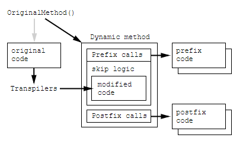

# Harmony Patching
_Originally written by Dragon of Nihility Shift on the [Void Crew Modding Discord](https://discord.gg/g2u5wpbMGu)._

Harmony is a library allowing mod developers to modify code of an external library in a dynamic and safe manner, 
allowing multiple mods to patch the same method. 
Harmony utilizes .NET Reflection for us to modify target method IL. 
In our case, we utilize HarmonyX as provided by BepInEx to patch the Void Crew libraries, mainly the Assembly-CSharp.dll file. 

This guide is meant to provide you with general information on patching, 
and other sources such as the official [harmony patching](https://harmony.pardeike.net/articles/patching.html) guide are available.

Patching requires 2 parts: the target, and the patch code. 
Patches are usually provided a target through the `[HarmonyPatch]` annotation, 
however there are rare cases where a targeting method inside the patch class is needed to find the correct patch target. 
Patches are generally of 3 types: Prefix, Postfix, and Transpiler, however there are other types which may be needed.

* Prefix
  * Places code before the target method.
  * May be used to cancel execution of the target method.
* Postfix
  * Places code after the target method.
* Transpiler
  * Modifies IL instructions of the target method.



## Targeting Annotations

For most patches, you'll be using the `[HarmonyPatch(Type, MethodName)]` annotation. 
An example of this usage is `[HarmonyPatch(typeof(FadeController), "Start")]`, where `typeof(FadeController)` provides 
the type for the targeted class, and `"Start"` provides the method name of the targeted class. 
This will provide the target to the annotated class or method, with application to the class applying to all methods within the class. 
Additionally, parts of the target can be provided through several annotations, 
as long as harmony understands what your annotation is meant to affect.

Annotations have become very dynamic over time and can be applied in various manners. Traditionally, it will be handled like the following:
```csharp
[HarmonyPatch(typeof(FadeController), "Start")]
class PatchClass
{
    static void PatchMethod1()
    ...Some Code...
    
    static void PatchMethod2()
    ...Some Code...
}
```

However, the dynamic design allows for the following:
Note: `[HarmonyPatch]` on line 1 is needed when implicitly applying the patch. If you are using Explicit applications, it may not be needed.

```csharp
[HarmonyPatch]
class PatchClass
{
    [HarmonyPatch(typeof(FadeController), "Start")]
    static void PatchMethod1()
    {...Some Code...}

    [HarmonyPatch(typeof(FadeController), "FadeToBlack")]
    static void PatchMethod2()
    {...Some Code...}

    [HarmonyPatch(typeof(FadeController), "FadeToClear")]
    class NestedPatchClase
    {
        static void NestedPatchMethod1()
        {...Some Code...}
    }
}
```

### Targeting Edge Cases
While the standard annotation works in most cases, sometimes you need to patch a constructor, property getter/setter, or method overload. 
In these cases you will need to be more specific, and the value can be provided through one of the various HarmonyPatch() overloads. 
The parameters provided only need to be specific until the target method is the only method found, 
else Harmony will throw a patching exception.

```csharp
[HarmonyPatch(typeof(FadeController), "FadeToClear", new Type[] { typeof(Action), typeof(float) })]
```

- The `MethodType` enum will allow you to narrow down property getters, setters, as well as constructors. Getters/Setters can be targetted by appending the method name with "get_" and "set_", however this is discouraged and the MethodType enum should be used. 
- The `Type[]` parameter will allow you to specify a specific method overload via the method's parameter types. 
- The `ArgumentType[]` parameter works alongside (but doesn't necessarily require) the `Type[]` parameter to specify each argument as a pointer, ref, out, or normal argument.

## How to use a Prefix
A Prefix will append your code in front of the targeted method. 
Prefixes can block the original code from executing, and in the process will block execution of subsequent Prefixes from other assemblies.

Postfixes are declared in HarmonyPatch-annotatized method/Classes through the method name "Prefix" or the annotation `HarmonyPrefix`.

```csharp
[HarmonyPatch(typeof(FadeController), "Start")]
class PatchClass
{
    static void Prefix()
    {...Some Code...}
}

[HarmonyPatch(typeof(FadeController), "Start")]
class PatchClass2
{
    [HarmonyPrefix]
    static bool FadeControllerStartPatch()
    {
        return true;
    }
}
```

## How to use Postfix
A Postfix will execute after the targeted method. Postfixes always run, even if a Prefix prevented the original method's execution.

Postfixes are declared in HarmonyPatch-annotatized method/Classes through the method name "Postfix" or the annotation HarmonyPostfix.

```csharp
[HarmonyPatch(typeof(FadeController), "Start")]
class PatchClass
{
    static void Postfix()
    {...Some Code...}
}
[HarmonyPatch(typeof(FadeController), "Start")]
class PatchClass2
{
    [HarmonyPostfix]
    static void FadeControllerStartPatch()
    {...Some Code...}
}
```

## Patching Parameters
While working on a prefix or postfix, you may need access to parameters or fields used in the original method such as this, 
method parameters, or nearby public/private/protected fields. 
To do so, you can ask harmony to provide it via your patch method parameters. 
For more information, read the [official harmony documentation](https://harmony.pardeike.net/articles/patching-injections.html).

For `this`, use `T __instance`, where T is your patched class.
```csharp
static void Postfix(FadeController __instance)
{...Some Code...}
```

For fields found inside the class regardless of public/private, use the field name prefixed with `'___'`. 
For a field of type `int` and name 'FooField', use `int ___FooField`, with ref in cases where you need to assign the value.

```csharp
static void Postfix(int ___FooField)
{...Some Code...}
```

For utilizing the original method's parameters, simply add a parameter with the same type and name. 
If the original parameter looks like `int` param1, you will only need `int param1`. 
If you're using a prefix, utilize the ref keyword to edit.
```csharp
static void Postfix(int param1)
{...Some Code...}
```

To receive the method's output value, use the `__result` keyword, with the ref keyword in the case you need to change it's value.
```csharp
static void Postfix(int __result)
{...Some Code...}
```

## How to use a Transpiler
Transpilers can be complicated, depending on what you want to change. 
Transpilers are provided the original method body as IL code (C# compiles into IL, which is interpreted at runtime by the JIT compiler.), 
and pass back a modified method body in IL. Unlike other patches, Transpilers only need to be run once.

Similarly to Postixes and Prefixes, Transpilers can be declared by method name Transpiler or the HarmonyTranspiler annotation.

```csharp
[HarmonyPatch(typeof(FadeController), "Start")]
class PatchClass
{
    static IEnumerable<CodeInstruction> Transpiler(IEnumerable<CodeInstruction> instructions)
    {
        foreach (CodeInstruction instruction in instructions)
        {
            if(instruction.opcode == OpCodes.Ldarg_0)
            {
                Debug.Log("Found this!");
                instructions.operand = null;
            }
        }
        return instructions;
    }
}
```

A CodeInstruction represents a single piece of IL in a method body, with OpCode being an instruction (think add, subtract, call) 
and Operand being what with (think Call => Mom). CodeInstructions utilize the method stack to pass data to the subsequent instruction. 
Read more [elsewhere](https://www.geeksforgeeks.org/cil-or-msil-microsoft-intermediate-language-or-common-intermediate-language/).

[VoidManager](https://github.com/Nihility-Shift/VoidManager) provides a utility (`VoidManager.Utilities.HarmonyHelpers`) 
to quickly search through and implement a patch 
for a given method via the use of  `PatchBySequence(instructions, targetSequence, patchSequence, PatchMode, CheckMode)`. 
This method can be provided a collection for the targetSequence and patchSequence to make a patch according to the mode, 
and many examples can be found in code by [Nihility Shift](https://github.com/Nihility-Shift).

Some instructions will require MethodInfos or FieldInfos, which may be the first direct exposure some users get to Reflection. 
Harmony provides helper methods to access these types in a familiar manner through the AccessTools class. 
`AccessTools.Method(type, methodName)` and `AccessTools.Field(type, fieldname)` should look familiar, 
and other methods are provided for specific cases such as constructors and property getter/setters.

## Patching Theory
Various tips and tricks for patching.

### Replacing a Method
Sometimes replacing a method is the easiest way to make your code work. 
Prefixes can be used to stop the original method from running early, but with a little work you can replace the original method entirely. 
This is not the most ideal, but will create a working replacement. 
If a transpiler is possible, it is recommended to use one instead for safer code in the event of an update.

### Transpiler Case
If it's your first time making a transpiler, it can look intimidating to inject your new code as a sequence of CodeInstructions. 
Sometimes it's just ridiculously difficult, and the best method I've found so far is to create a method to call.
You can interrupt and re-return a value from the stack to easily inject code, and it saves you writing 20 lines of custom CIL.