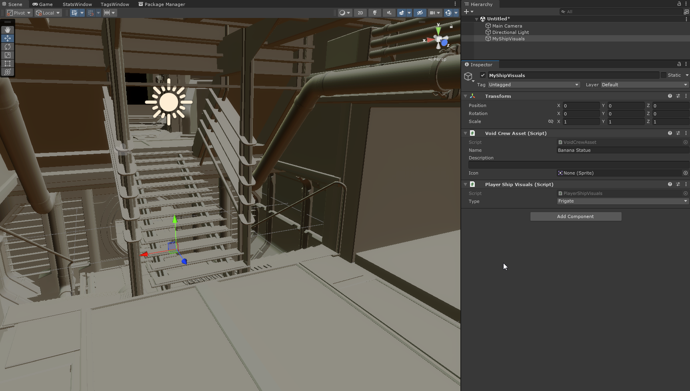
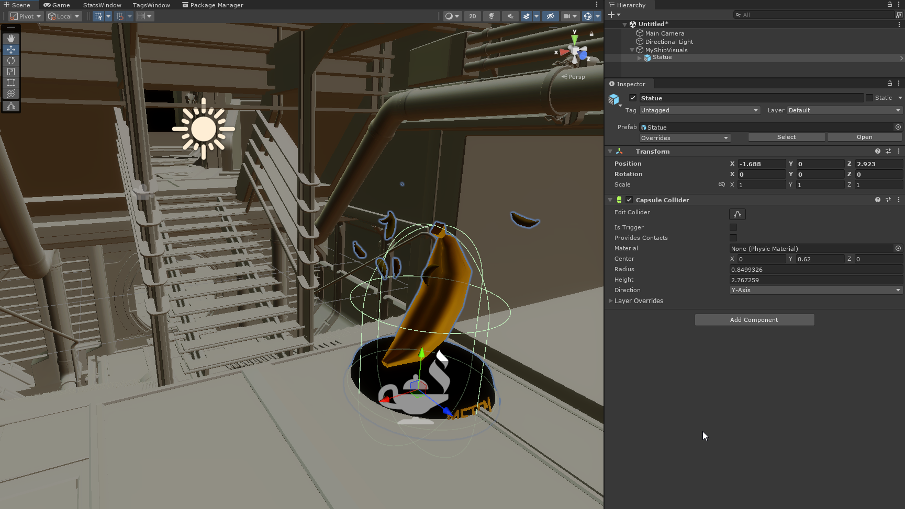
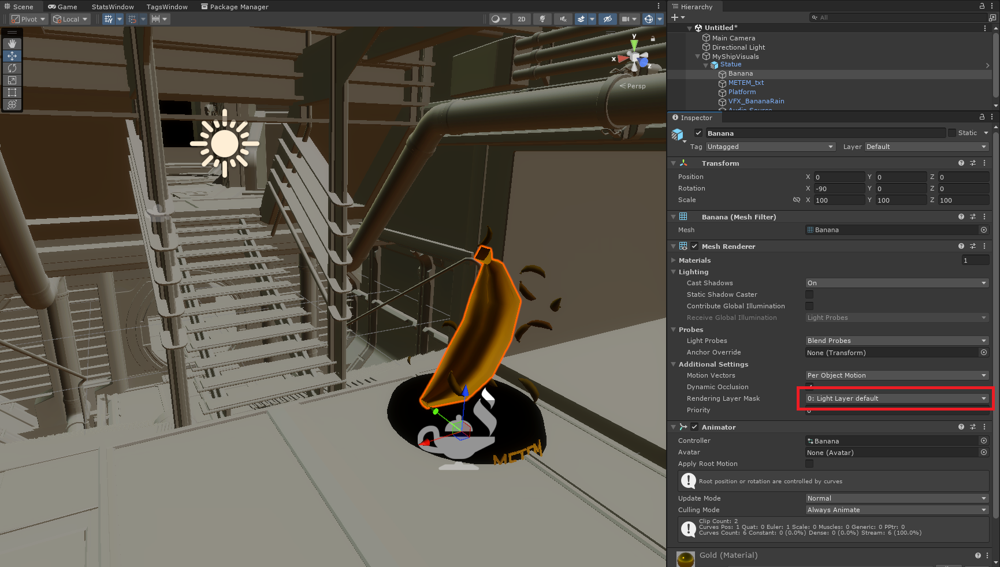
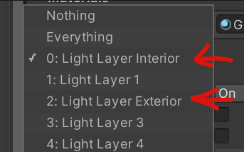
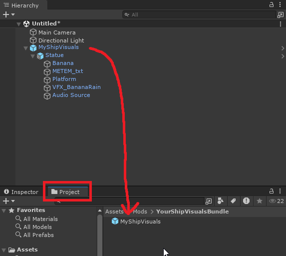
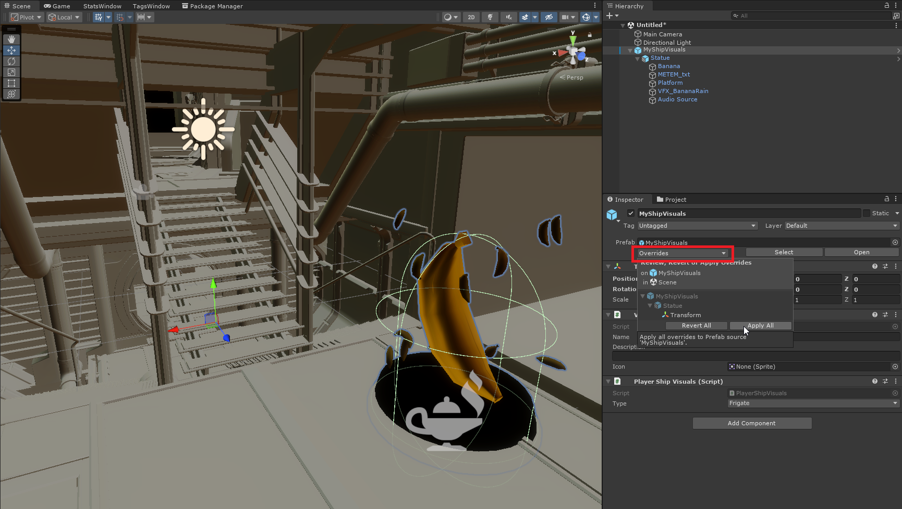

# Ship Visuals
You can add custom visuals to be attached to the player ships. 
These visuals can theoretically contain any native game object components (such as particle systems, colliders, visual effects, audio etc.)

Example Ship Visuals are included in the Sample Project [here](https://github.com/HutlihutGames/void_crew_mods_sample/tree/master/Assets/Mods/ShipVisuals).

```{hint}
While making Ship Visuals, you will want to work within the Unity Scene for the preview tooling to work. 
```

Right click within the scene hierarchy and choose Create an Empty to make an empty game object. Then add the following components to the object:
- `Void Crew Asset`
- `Player Ship Visuals`



The preview tooling will render a simplified model of the ship for as long as the object (or a child) is selected. 
You can change which model to render on the `Player Ship Visuals` component (Frigate, Destroyer, Striker, Hub).

```{hint}
You can add visuals to the Hub! The Hub is technically a ship in the game. To do this, select Hub on the Player Ship Visuals component
```

Next, add all the objects you want as a child of the object containing the Player Ship Visuals component. 
You can make this as complex or as simple as you like. Make sure to place them reasonably.



You will need to set the correct **Rendering Layer Mask** on each renderer you add depending on whether the model is _inside_ or _outside_ the ship.

- Choose layer index 0 for models inside the ship.
- Choose layer index 2 for models outside the ship.




```{important}
The rendering layer mask is based on the indices. 
In the project's HDRP settings you can rename the layer names to make it easier to remember what is what, as long as you still use the same indices. 
```

Once you're satisfied, create a prefab from where the `Player Ship Visuals` component is sitting and put the prefab inside your asset bundle folder.



```{important}
Remember to include all assets used by your ship visuals within the root of your asset bundle folder!
```

If you make changes after you have already created the prefab, you will need to apply the overrides. 
To do this, select the root of the prefab, then open the Overrides dropdown in the Inspector and apply all overrides.



## Reference Ship Models
For making advanced ship visuals, you may want to use the reference models more directly. 
You may also want to setup complex visuals or a group of visuals from within Blender.

For that you can find reference models for the Frigate, Destroyer, Striker and Hub on the Void Crew Common Github [here](https://github.com/HutlihutGames/void_crew_common/tree/master/Packages/com.hutlihut.void_crew_common/Editor/Resources).